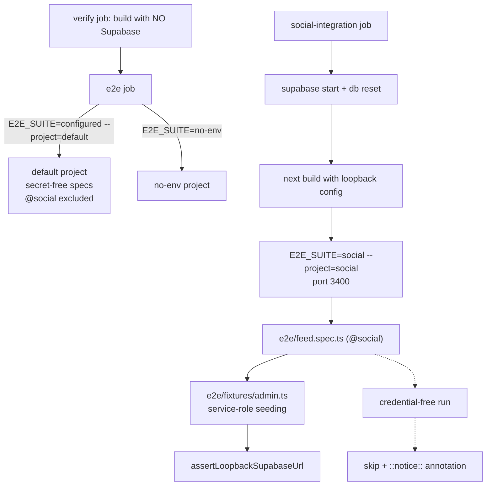

# Requirements

### Overview & Goals

GitHub CI fails on `e2e/feed.spec.ts`. The `Playwright E2E` job runs
`E2E_SUITE=configured npx playwright test --project=default` against the build
produced by `verify`, which is intentionally built with **no Supabase
configuration**. The following-feed journey is the only untagged spec that
imports the service-role helpers in `e2e/fixtures/admin.ts`, so
`ensureFeedFixtureUsers()` → `createAdminClient()` → `requireEnv("SUPABASE_URL")`
throws before the journey starts:

```
Error: [e2e fixtures] Missing SUPABASE_URL. The fixtures suite needs LOCAL
Supabase credentials injected by scripts/run-e2e-local.mjs …
```

Goals:

1. CI is green again, without silently deleting coverage.
2. The following-feed journey is **still actually executed** in CI, secret-free,
   against a throwaway local Supabase stack.
3. The journey can never race the `@fixtures` social-lists journey over the
   shared `social_a` / `social_b` accounts.
4. A credential-free invocation of the journey **skips honestly and loudly**
   rather than throwing a confusing fixture error.

### Scope

**In scope**

- A dedicated `@social` Playwright suite/project for the multi-user
  following-feed journey, removed from the credential-free `default` project.
- A loopback-aware skip gate so the journey degrades honestly when no Supabase
  target is configured, with an explicit GitHub annotation when it skips.
- A new secret-free CI job (`social-integration`) that starts local Supabase,
  applies migrations, builds a Supabase-configured build, and runs the `@social`
  suite for real.
- npm script + local runner support (`npm run test:e2e:social`), and inclusion
  in the `test:e2e` aggregate.
- Documentation updates in `README.md` and `AGENTS.md` where the e2e suites and
  commands are enumerated.

**Out of scope**

- Any change to feed product behaviour, `app/feed/**`, `lib/supabase/feed*`, or
  the feed UI components.
- Any change to the `@fixtures` / `@prodreject` / `no-env` / `configured`
  suites' contents or their guarantees.
- Weakening the loopback safety guard in
  `scripts/lib/local-supabase-target.mjs` — no override that permits a hosted
  target is introduced.
- Adding any repository secret (no TMDB / OpenAI / hosted Supabase credentials
  in CI).

### User Stories

- As a contributor, I want CI on `main`/PRs to pass without Supabase secrets, so
  that ordinary changes are not blocked by an unrunnable journey.
- As a maintainer, I want the following-feed journey exercised on every CI run
  against a real seeded database, so regressions in follow → feed → edit →
  delete → unfollow are caught before merge.
- As a developer running the suite locally, I want one command
  (`npm run test:e2e:social`) that resets local Supabase and runs the journey
  against a loopback-verified stack.
- As a reviewer, I want a skipped journey to be visible in the job summary, so a
  misconfigured run can never look like a passing one.

### Functional Requirements

1. `e2e/feed.spec.ts` no longer runs in the `default` Playwright project.
2. `E2E_SUITE=social npx playwright test --project=social` runs exactly the
   following-feed journey against its own server/port.
3. With **no** Supabase URL configured at all, the journey is skipped with a
   clear reason, and (in CI) a `::notice::` annotation naming the journey and
   the reason is emitted.
4. With a Supabase URL present but **not** loopback, or with the service-role
   key missing, existing behaviour is unchanged: the run fails loudly via
   `assertLoopbackSupabaseUrl` / `requireEnv`. The skip never masks a
   misconfiguration or a hosted target.
5. A new CI job runs the `@social` suite against `npx supabase start` +
   `npx supabase db reset`, using only the throwaway local stack's credentials.
6. `npm run test:e2e` still runs every suite locally, including the new one, and
   each suite resets the database before it starts, so suites never race.

### Non-Functional Requirements

- **Secret-free CI**: no new repository secrets; the new job must be runnable on
  a fork PR exactly like `explore-integration` and `database`.
- **Safety preserved**: every write path stays loopback-gated; the new predicate
  is an _absence_ check, never a new local/hosted decision.
- **Runtime**: the journey sets `test.setTimeout(240_000)` and CI uses
  `workers: 1` with `retries: 2`; the new job gets an explicit
  `timeout-minutes` bound so a hung run fails rather than burning CI minutes.
- **Honesty**: a skipped journey is never reported as coverage.

# Technical Design

### Current Implementation

| Piece                       | Current state                                                                                                                                                                                                                                                                                         |
| --------------------------- | ----------------------------------------------------------------------------------------------------------------------------------------------------------------------------------------------------------------------------------------------------------------------------------------------------- |
| `playwright.config.ts`      | `E2E_SUITE` selects one of four project sets: `no-env`, `fixtures`, `fixtures-prod-reject`, else `configured` (= `default` + `configured` projects). `default` uses `grepInvert: /@configured\|@no-env\|@fixtures\|@prodreject/`. Ports 3000 / 3100 / 3200 / 3300.                                    |
| `e2e/feed.spec.ts`          | `test.describe.serial("Following feed journey")` — **untagged**, so it lands in `default`. Its header explains it deliberately avoids `@fixtures` because both re-provision `SOCIAL_USER_A/B`.                                                                                                        |
| `e2e/fixtures/admin.ts`     | `requireEnv` throws on missing `SUPABASE_URL` / `SUPABASE_SECRET_KEY`; `createAdminClient` then hard-gates on `assertLoopbackSupabaseUrl`.                                                                                                                                                            |
| `scripts/run-e2e-local.mjs` | `ALLOWED = {configured, fixtures, fixtures-prod-reject}`; resolves loopback creds via `resolveLocalSupabaseTestEnv`, builds, then runs Playwright.                                                                                                                                                    |
| `.github/workflows/ci.yml`  | `verify` (no Supabase) → artifact → `e2e` runs `--project=default` and the `no-env` suite; `explore-integration` independently starts local Supabase, exports loopback config, builds a configured build, and runs `--project=configured`; `database` runs pgTAP.                                     |
| Catalog data                | Every slug the feed fixtures seed (`dune-part-two`, `salt-tide`, `arc-lighthouse`, `the-gilded-room`, …) is inserted by migrations `20260806160100_catalog_media_items.sql` + `20260815120000_catalog_enrich_media_items.sql`, so `supabase db reset` alone is sufficient — no seed additions needed. |

Root cause: a journey that **requires** service-role writes is routed into the
one project CI deliberately runs **without** Supabase.

### Key Decisions

1. **Dedicated `@social` suite rather than `@fixtures` or a bare skip.**
   The journey re-provisions the shared social accounts, so it must be isolated
   from the `@fixtures` social-lists journey (separate run, separate database
   reset). A new tag + project + port keeps the existing spec header's isolation
   reasoning true and makes the suite independently runnable in CI.
2. **Skip on _absence_ of a Supabase target, never on "not loopback".**
   A new pure predicate `isSupabaseTargetAbsent(env)` lives in the already
   unit-tested `scripts/lib/local-supabase-target.mjs`. A present-but-hosted URL
   or a missing service-role key still fails loudly through the existing guards.
   This mirrors the semantics of `assertConfiguredSupabaseIsLocal`.
3. **Secret-free CI job modelled on `explore-integration`.**
   Same shape: `supabase start` → `db reset` → export loopback config with the
   fail-closed `case` guard → Supabase-configured `npm run build` → run the
   suite → `supabase stop`. No embedding/eval steps; `SEMANTIC_SEARCH_ENABLED`
   is pinned off so no OpenAI path is reachable.
4. **Skip visibility via a GitHub workflow command from the test process.**
   A small `e2e/fixtures/ci-notice.ts` helper emits `::notice title=…::…` on
   stdout only when `process.env.CI` is set, so an accidentally credential-free
   run surfaces in the job summary instead of hiding in a skipped count.
5. **No change to the app, the feed domain logic, or the safety guard.**
   This is a test-infrastructure fix only.

### Proposed Changes

**1. Tag and gate the journey — `e2e/feed.spec.ts`**

- Rename the describe title to `"@social Following feed journey"`.
- Replace the header paragraph about deliberately using the `default` project
  with the new reasoning: its own suite, its own server, its own database reset,
  so it can never race `@fixtures`.
- Add the gate as the first statement of the test body (matching the convention
  in `favorites.spec.ts` and the live-semantic block of `explore-search.spec.ts`):

```ts
test.skip(
  !hasFixtureSupabaseTarget(),
  "Requires a LOCAL Supabase target. Run via `npm run test:e2e:social` " +
    "(start the stack with `npm run supabase:start`).",
);
```

**2. Pure predicate — `scripts/lib/local-supabase-target.mjs`**

```js
/**
 * True when NO Supabase target is configured at all (the intentional
 * unconfigured / no-env build). A PRESENT target is deliberately NOT judged
 * here: `assertLoopbackSupabaseUrl` remains the only local/hosted decision.
 */
export function isSupabaseTargetAbsent(env = process.env) {
  const urls = [env.SUPABASE_URL, env.NEXT_PUBLIC_SUPABASE_URL];
  return urls.every((v) => typeof v !== "string" || v.trim() === "");
}
```

Unit-tested alongside the existing cases in
`scripts/lib/local-supabase-target.test.ts`.

**3. Fixture helpers — `e2e/fixtures/admin.ts`**

```ts
/** Skip-gate input: a target is "available" unless nothing is configured. */
export function hasFixtureSupabaseTarget(): boolean {
  const available = !isSupabaseTargetAbsent(process.env);
  if (!available) emitCiNotice("Following feed journey skipped", "…");
  return available;
}
```

`requireEnv` / `createAdminClient` are untouched, so a loopback URL with a
missing key still throws.

**4. New suite — `playwright.config.ts`**

- `const SOCIAL_PORT = 3400;` and `const isSocialSuite = suite === "social";`
- `socialProjects`: one project `social` with `grep: /@social\b/` and
  `baseURL: http://localhost:3400`.
- Add `@social` to the `default` project's `grepInvert`.
- `webServer` branch: `npm run start -- --port 3400` with
  `env: { SEMANTIC_SEARCH_ENABLED: "false" }`.
- The existing `assertConfiguredSupabaseIsLocal(process.env)` pre-flight already
  covers the new suite (it applies to everything except `no-env`).

**5. Runner + scripts**

- `scripts/run-e2e-local.mjs`: add `"social"` to `ALLOWED` and to the usage
  string.
- `package.json`:
  - `"test:e2e:social": "npm run supabase:reset && node scripts/run-e2e-local.mjs social"`
  - `test:e2e` chain becomes `configured → social → fixtures → fixtures-prod-reject → no-env`.

**6. CI — `.github/workflows/ci.yml`**

New job `social-integration` (`needs: verify`, `timeout-minutes: 30`), a trimmed
copy of `explore-integration`:

1. checkout, Node 22, `npm ci`
2. `npx supabase start`
3. `npx supabase db reset` (migrations provide the whole curated catalog)
4. Export local config — reuse the existing `eval` + loopback `case` guard block
   that publishes `NEXT_PUBLIC_SUPABASE_URL`, `NEXT_PUBLIC_SUPABASE_PUBLISHABLE_KEY`,
   `SUPABASE_URL`, `SUPABASE_SECRET_KEY` to `$GITHUB_ENV`
5. `npm run build` (Supabase-configured; `SEMANTIC_SEARCH_ENABLED: "false"`)
6. `npx playwright install --with-deps chromium`
7. `E2E_SUITE=social npx playwright test --project=social`
8. `npx supabase stop --no-backup` (`if: always()`)
9. Upload `playwright-report` as `playwright-report-social-integration`

The existing `e2e` job is unchanged — the `@social` tag alone removes the spec
from `--project=default`.

**7. Documentation**

- `README.md`: add `npm run test:e2e:social` to the scripts block and name the
  `social` suite in the "Local-only E2E isolation" paragraph and the testing
  strategy bullet.
- `AGENTS.md`: list the new command where the e2e commands are enumerated, and
  note that the following-feed journey runs in its own loopback-only suite.

### File Structure

```
.github/workflows/ci.yml                      # + social-integration job
playwright.config.ts                          # + social suite/project/port 3400
package.json                                  # + test:e2e:social, updated test:e2e
scripts/run-e2e-local.mjs                     # + "social" allowed suite
scripts/lib/local-supabase-target.mjs         # + isSupabaseTargetAbsent()
scripts/lib/local-supabase-target.test.ts     # + unit tests for the predicate
e2e/feed.spec.ts                              # @social tag + skip gate + header
e2e/fixtures/admin.ts                         # + hasFixtureSupabaseTarget()
e2e/fixtures/ci-notice.ts                     # NEW: ::notice:: emitter (CI only)
README.md, AGENTS.md                          # suite/command documentation
```

### Architecture Diagram



### Risks

- **Silent skipping.** Mitigated by the CI annotation, by the absence-only
  predicate (a hosted or half-configured target still fails loudly), and by the
  new job that runs the journey for real on every CI run.
- **New job runtime/flakiness.** The journey already allows 240 s and CI retries
  twice with one worker; `timeout-minutes` bounds the job, and the report is
  uploaded on failure for triage.
- **Docker availability.** Same prerequisite as the existing `database` and
  `explore-integration` jobs on `ubuntu-latest`; no new requirement.
- **Port collision.** 3400 is unused by the existing 3000/3100/3200/3300/5599
  allocation.
- **Drifting suite lists.** `default`'s `grepInvert`, the `E2E_SUITE` branches,
  the runner's `ALLOWED` set, and the docs must all learn about `social` —
  covered explicitly in the delivery stages.

# Testing

### Validation Approach

- Unit-test the new pure predicate in `scripts/lib/local-supabase-target.test.ts`
  (`npm run test`), since it is the only new logic.
- Verify suite routing with Playwright's dry-run listing rather than full runs,
  so the project/tag wiring is proven cheaply.
- Run the journey end-to-end locally against the loopback stack.
- Run the unchanged CI commands locally to prove the original failure is gone.

### Key Scenarios

1. **The reported failure is fixed.** `npx playwright test --project=default --list`
   with `E2E_SUITE=configured` and no Supabase env no longer lists
   `e2e/feed.spec.ts`, and the run completes without the
   `[e2e fixtures] Missing SUPABASE_URL` error.
2. **The journey still runs for real.** With the local stack up,
   `npm run test:e2e:social` resets the database, builds against loopback
   credentials, and the full follow → feed → edit → delete → unfollow journey
   passes.
3. **Suite selection is exact.** `E2E_SUITE=social … --list` lists exactly the
   one `@social` journey and nothing else; the `fixtures`, `fixtures-prod-reject`,
   `configured`, and `no-env` listings are byte-for-byte unchanged.
4. **Honest skip.** `E2E_SUITE=social` with no Supabase env reports the test as
   skipped with the guidance message, and with `CI=1` also prints the
   `::notice::` line.

### Edge Cases

- **Hosted URL present** (e.g. a stray `.env.local` value exported): the run must
  still be **rejected** by `assertConfiguredSupabaseIsLocal` /
  `assertLoopbackSupabaseUrl` — never skipped.
- **Loopback URL but missing `SUPABASE_SECRET_KEY`**: `requireEnv` must still
  throw; the gate must not swallow a half-configured environment.
- **Blank-but-defined variables** (`SUPABASE_URL=""`, whitespace-only): treated
  as absent by the predicate.
- **`npm run test:e2e` ordering**: each suite runs `supabase db reset` first, so
  the `@social` and `@fixtures` journeys cannot collide over `social_a`/`social_b`.

### Test Changes

- **Add** unit tests for `isSupabaseTargetAbsent` (both absent, one present, only
  `NEXT_PUBLIC_*` present, whitespace-only, hosted value present → not absent).
- **Modify** `e2e/feed.spec.ts`: tag + skip gate + corrected header rationale;
  the journey's assertions are untouched.
- **No** new product/unit tests — no application behaviour changes.

# Delivery Steps

### ✓ Step 1: Add an absence-only Supabase target predicate and an honest skip gate

A credential-free run of the following-feed journey skips with a clear reason instead of throwing `Missing SUPABASE_URL`, while a hosted or half-configured target still fails loudly.

- Add `isSupabaseTargetAbsent(env = process.env)` to `scripts/lib/local-supabase-target.mjs`: true only when both `SUPABASE_URL` and `NEXT_PUBLIC_SUPABASE_URL` are missing/blank. It deliberately makes no local-vs-hosted judgement — `assertLoopbackSupabaseUrl` stays the single source of truth for that.
- Cover it in `scripts/lib/local-supabase-target.test.ts`: both absent, only the public var set, whitespace-only values, and a hosted value present (must report _not_ absent).
- Add `e2e/fixtures/ci-notice.ts` exporting `emitCiNotice(title, message)` that prints a `::notice title=…::…` workflow command on stdout only when `process.env.CI` is set.
- Add `hasFixtureSupabaseTarget()` to `e2e/fixtures/admin.ts` built on the predicate, emitting the CI notice when it returns false. Leave `requireEnv` and `createAdminClient` untouched so a loopback URL with a missing service-role key still throws.
- Add `test.skip(!hasFixtureSupabaseTarget(), …)` as the first statement of the journey in `e2e/feed.spec.ts`, matching the convention already used in `favorites.spec.ts`.

### ✓ Step 2: Introduce the dedicated @social Playwright suite and local runner support

The following-feed journey runs in its own isolated suite on its own port and is no longer collected by the credential-free `default` project.

- Tag the journey `@social` in `e2e/feed.spec.ts` (`test.describe.serial("@social Following feed journey")`) and rewrite the header paragraph: it now has its own suite, server, and database reset, so it can never race the `@fixtures` social-lists journey over `SOCIAL_USER_A`/`SOCIAL_USER_B`.
- In `playwright.config.ts`: add `SOCIAL_PORT = 3400`, `isSocialSuite = suite === "social"`, a `socialProjects` entry with `grep: /@social\b/` and the 3400 base URL, and a matching `webServer` branch (`npm run start -- --port 3400`, `SEMANTIC_SEARCH_ENABLED: "false"`).
- Add `@social` to the `default` project's `grepInvert` so the spec is excluded from the CI default run.
- Extend `ALLOWED` and the usage message in `scripts/run-e2e-local.mjs` with `"social"`.
- Add `"test:e2e:social": "npm run supabase:reset && node scripts/run-e2e-local.mjs social"` to `package.json` and insert it into the `test:e2e` chain after `test:e2e:configured`.
- Verify routing with `--list` for every suite: `@social` appears only under `social`, and the `configured`, `fixtures`, `fixtures-prod-reject`, and `no-env` listings are unchanged.

### ✓ Step 3: Add the secret-free seeded CI job that actually runs the journey

Every CI run executes the full follow → feed → edit → delete → unfollow journey against a throwaway local Supabase stack, with no repository secrets.

- Add a `social-integration` job to `.github/workflows/ci.yml` (`needs: verify`, `timeout-minutes: 30`), modelled on `explore-integration` but without the embedding and evaluation steps.
- Steps: checkout → Node 22 + `npm ci` → `npx supabase start` → `npx supabase db reset` (migrations `20260806160100` and `20260815120000` already provide every catalog slug the fixtures seed).
- Reuse the existing config-export block verbatim: `eval` the trusted `supabase status -o env` assignments, fail closed via the loopback `case` guard, and `printf` the unquoted `NEXT_PUBLIC_SUPABASE_URL`, `NEXT_PUBLIC_SUPABASE_PUBLISHABLE_KEY`, `SUPABASE_URL`, and `SUPABASE_SECRET_KEY` into `$GITHUB_ENV`.
- Build a Supabase-configured build (`npm run build` with `SEMANTIC_SEARCH_ENABLED: "false"`), install Chromium, then run `E2E_SUITE=social npx playwright test --project=social`.
- Stop the stack with `if: always()` and upload the report as `playwright-report-social-integration` with `if: ${{ !cancelled() }}`.
- Leave the existing `e2e` job untouched and confirm it no longer collects `e2e/feed.spec.ts`.

### ✓ Step 4: Update the suite documentation and run the validation gates

The repository docs describe the new suite and command, and the applicable validation commands pass.

- `README.md`: add `npm run test:e2e:social` to the scripts block, name the `social` suite in the "Local-only E2E isolation" paragraph alongside `configured` / `fixtures` / `fixtures-prod-reject`, and mention the following-feed journey in the Playwright testing-strategy bullet.
- `AGENTS.md`: list the new command where the e2e commands are enumerated and note that the following-feed journey lives in its own loopback-only suite with a dedicated secret-free CI job.
- Run `npm run format:check`, `npm run lint`, `npm run typecheck`, and `npm run test` (the new predicate tests included).
- Reproduce the CI default run locally with no Supabase env (`E2E_SUITE=configured npx playwright test --project=default`) and confirm the `Missing SUPABASE_URL` failure is gone.
- With the local stack running, execute `npm run test:e2e:social` and confirm the full journey passes end to end.
