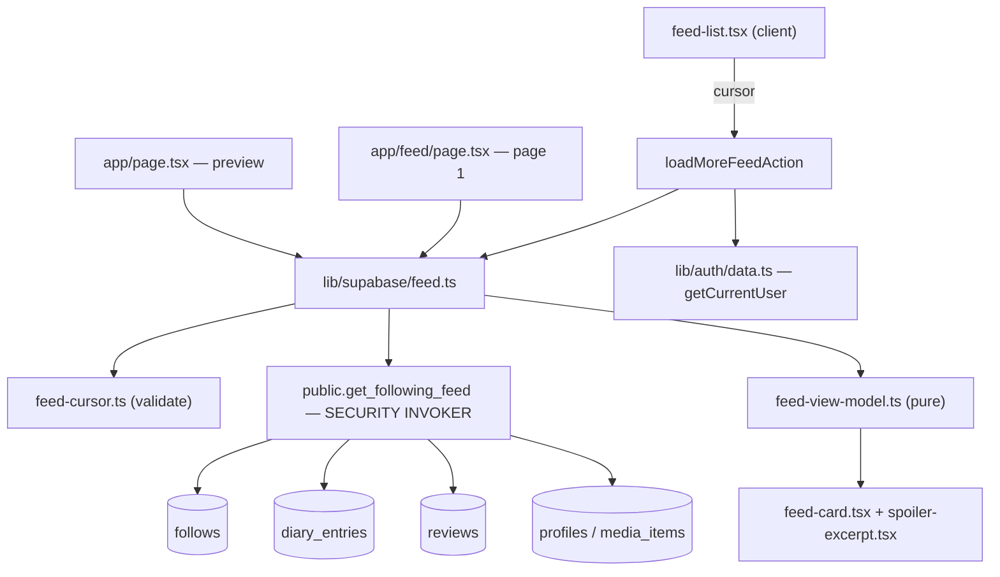

# Requirements

### Overview & Goals

Phase **4B.2 — Real Following Feed and Honest Home Activity**. Following someone currently changes nothing a viewer can _see_ beyond follower counts and follower-only lists. This phase makes following pay off: a chronological, persistence-backed feed of the real entertainment activity of accounts the viewer follows, surfaced both as a Home preview and at a dedicated `/feed` route — and it removes Home's fabricated popularity/personalization claims in configured mode.

The work runs in three arcs: **reconcile** stale documentation, **implement** the feed, **verify** the full journey.

### Scope

**In scope**

- A `public.get_following_feed(...)` SECURITY INVOKER RPC (forward-only migration, 29th) + supporting indexes + pgTAP.
- Server-only read layer, validated versioned keyset cursor, pure view-model mapping.
- New `/feed` route with a "Load more" Server Action, plus a Home preview replacing mock "From your circle".
- A discoverable primary-nav entry for the feed.
- Genuine spoiler concealment (today `contains_spoilers` is stored but **never actually hidden** — `review-card.tsx` and `real-profile.tsx` only italicise it).
- Home truthfulness: hide "Trending this week", "Popular reviews", and "Because you liked…" in configured mode; add one honest "Explore the catalog" shelf from the real browse reader.
- Roadmap / architecture documentation reconciliation, including the owner-supplied TMDB clarification.

**Out of scope (explicitly not built here)**

- Event store, fan-out-on-write, queues, or snapshots of user content — inspection shows no necessity.
- List activity, favorites, follow announcements, likes, comments, notifications, inferred "started"/"finished" events.
- Trending algorithms, recommendations, a community-review system.
- TMDB activation or refresh implementation; **no provider flag changes** (`TMDB_ENABLED` stays false).
- Follow-time cutoffs, moderation, personalized discovery, games.
- Any hosted Supabase mutation, deploy, commit, or push.

### User Stories

- As a signed-in user, I want to see what people I follow have watched, read, and reviewed, so following has visible value.
- As a user following nobody, I want the feed to explain itself and point me at community lists, so I can find people.
- As a reader, I want spoiler-marked writing to stay concealed until I choose to reveal it.
- As someone who unfollows, I want that account's activity to disappear from Home, the feed, and every subsequent page.
- As a visitor, I never want to see another account's personalized feed via browser-back or a prefetched route.

### Functional Requirements

**Feed contract — included**

- Real diary logs (`public.diary_entries`) authored by accounts the viewer _currently_ follows.
- Their ratings, and the excerpt of a linked review.
- Standalone reviews (`reviews.diary_entry_id is null`) — these _are_ independent persistent records in the current schema, so they qualify.

**Excluded:** the viewer's own activity, non-followed users, list activity, favorites, follow announcements, likes, comments, notifications, and any inferred completion event.

**Deduplication.** A diary entry plus its linked review render as **one** combined item. Never a separate diary card, rating card, and review card for the same action.

**Wording.** Source-backed only, via the existing `deriveDiaryAction(kind, is_revisit)`: _watched / rewatched / read / reread_, and _reviewed_ for a standalone review. A rating alone never implies completion.

**Ordering.** Newest first by immutable record creation time (`created_at`), with a deterministic total order that breaks ties across source types. The user-selected diary date (`logged_at`) is shown separately when it differs. Editing an entry must not bump it — `created_at` is never touched by the `set_updated_at` trigger.

**Relationship semantics.** Following exposes that account's existing eligible history through pagination (no follow-time cutoff this slice). Unfollowing removes them from subsequent reads. Edits update displayed content; deletions remove it — no stale excerpts retained anywhere.

**States.** Signed out (sign-in invitation via safe `returnTo`) · following nobody · following-but-no-activity · loading · loading another page · end of results · read failure with retry · Supabase unconfigured (clearly labelled example or unavailable). **Mock activity is never substituted after a configured read failure.**

**Links.** Each card links separately to the actor's canonical profile, the canonical title, and the review destination that actually exists. No nested links, no dead controls, and never a link into another user's private diary.

### Non-Functional Requirements

- Authorization derived exclusively from `auth.uid()`; source RLS preserved as an independent boundary.
- Bounded page size with an explicit maximum; eligibility and authorization applied _before_ pagination.
- Viewer-specific reads stay out of shared caches; client feed state clears on follow/unfollow, diary/review edit or delete, sign-out, and account change.
- Favalog editorial design preserved: responsive layout, light/dark/system themes, semantic HTML, keyboard access, visible focus.
- Strict TypeScript, no `any`, no suppressed lint/TS errors, no weakened coverage thresholds.

# Technical Design

### Current Implementation

Inspection findings that drive every decision below:

| Area                                           | Reality found                                                                                                                                                                                       |
| ---------------------------------------------- | --------------------------------------------------------------------------------------------------------------------------------------------------------------------------------------------------- |
| `app/page.tsx`                                 | 100% mock. `activity.slice(0,6)` from `@/lib/data` renders "From your circle"; "View all" points at **`/diary`**, not a feed. Trending / popular reviews / "Because you liked…" are all fabricated. |
| `components/activity/activity-card.tsx`        | Mock-typed (`ActivityItem`), verbs include invented `started`/`finished`, **no actor profile link**, **no spoiler handling**. Not reusable for a truthful feed.                                     |
| `supabase/migrations/20260805150300`           | `diary_entries`: `logged_at` (user-chosen) **and** `created_at` (immutable), `rating`, `is_revisit`; trigger updates only `updated_at`.                                                             |
| `supabase/migrations/20260805150400`           | `reviews`: optional `diary_entry_id` (`on delete set null`), `contains_spoilers`, and a CHECK enforcing that a linked review carries **no** rating — the diary entry is the rating source of truth. |
| `supabase/migrations/20260805150700`           | `diary_entries`, `reviews`, `profiles`, `follows` are all RLS **public-read (`using (true)`)**; writes owner-only.                                                                                  |
| `supabase/migrations/20260815120800`           | `set_follow` RPC — the security template: SECURITY INVOKER, `search_path = ''`, schema-qualified, `auth.uid()` only, EXECUTE revoked from `public`/`anon`.                                          |
| `lib/supabase/profile-activity.ts`, `diary.ts` | The established read pattern: `server-only`, `unavailable`/`error`/`ok` discriminated results, embedded joins (no N+1), pure view-model helpers, `mapMediaRowToDomain`.                             |
| Spoilers                                       | Captured everywhere (`log-input.ts`, `diary.ts`, `contains_spoilers`) but **no UI conceals them** — only italics.                                                                                   |
| Caching                                        | No route sets `dynamic`/`revalidate`; cookie-reading auth DAL already forces per-request rendering.                                                                                                 |

### Key Decisions

1. **Derive, don't denormalize.** `diary_entries` + `reviews` + `follows` are already the authoritative, RLS-governed records. No event store, fan-out, queue, or content snapshot — edits and deletes propagate for free, and nothing can retain a stale excerpt.
2. **A single narrow RPC** (`public.get_following_feed`) performs the follows join, self/non-follow exclusion, linked-review dedup, total ordering, keyset seek, and bounded limit in SQL. One bounded page crosses the boundary; the whole graph is never pulled into memory.
3. **SECURITY INVOKER — no DEFINER escalation.** Because every source table is public-read under RLS, the RPC needs no privilege elevation. Following is an _additional selection condition_, never a bypass. No service-role access.
4. **Diary entry is the activity unit.** A linked review is embedded into its diary item; only `diary_entry_id is null` reviews become their own items. Dedup happens in SQL, so it cannot be defeated by pagination boundaries.
5. **Total order `(created_at desc, source_rank asc, id desc)`** with `source_rank`: diary = 0, review = 1. This is unique and stable even for identical timestamps across source types.
6. **Versioned opaque cursor, never authorization.** Every page re-evaluates current follows and source RLS server-side; the cursor only positions the seek.
7. **Load more via Server Action.** Page 1 is server-rendered; a small client list appends subsequent pages and resets its accumulated state on identity/relationship change.

### Proposed Changes

#### Database — migration `20260815120900_following_feed.sql` (29th, forward-only)

```sql
create or replace function public.get_following_feed(
  p_limit              int         default 20,
  p_cursor_created_at  timestamptz default null,
  p_cursor_source      text        default null,
  p_cursor_id          uuid        default null
) returns table (
  source           text,          -- 'diary' | 'review'
  activity_id      uuid,
  created_at       timestamptz,
  logged_at        timestamptz,
  actor_username   text,
  actor_display_name text,
  actor_avatar_url text,
  media_slug       text,
  media_title      text,
  media_year       int,
  media_kind       text,
  media_poster_url text,
  rating           numeric(2,1),
  is_revisit       boolean,
  review_id        uuid,
  review_title     text,
  review_body      text,          -- bounded via left(body, 600)
  contains_spoilers boolean
)
language sql
security invoker
set search_path = ''
as $$ ... $$;
```

- **No caller-supplied viewer id.** Viewer identity is `auth.uid()` only; a null uid returns zero rows (and EXECUTE is revoked from `anon`/`public`, granted to `authenticated`).
- Eligibility: `exists (select 1 from public.follows f where f.follower_id = auth.uid() and f.following_id = src.user_id)` **and** `src.user_id <> auth.uid()` (explicit, belt-and-braces).
- Diary arm left-joins its linked review; review arm filters `diary_entry_id is null`.
- `p_limit` clamped server-side (`least(greatest(coalesce(p_limit,20),1), 50)`); eligibility and ordering are applied **before** the limit.
- Cursor predicate is the standard row-comparison seek on `(created_at, source_rank, id)`.
- Returns only public identity, canonical media references, and authorized activity fields — never auth metadata, emails, ids of private lists, or internal columns.
- Supporting indexes (added only after inspecting a local `EXPLAIN (ANALYZE, BUFFERS)` plan):
  - `diary_entries (user_id, created_at desc, id desc)`
  - `reviews (user_id, created_at desc, id desc) where diary_entry_id is null`
- `lib/database.types.ts` regenerated via `npm run supabase:types`, with a drift check (regenerate → `git diff --exit-code`).

#### Server layer (all `server-only`)

- **`lib/supabase/feed-cursor.ts`** (pure, unit-tested) — `encodeFeedCursor(row)` / `decodeFeedCursor(raw)` over `v1:<iso-with-microseconds>:<diary|review>:<uuid>`. Rejects a wrong version, bad shape, non-ISO timestamp, unknown source, or malformed UUID. Exact database timestamp precision is preserved (microseconds, not `Date`-rounded milliseconds).
- **`lib/supabase/feed-view-model.ts`** (pure, unit-tested) — row → `FeedActivityView`; derives the verb through the existing `deriveDiaryAction`, resolves the effective rating from the diary entry, builds the excerpt with the existing `excerptOf`, and marks `logged_at` for display only when it differs materially from `created_at`.
- **`lib/supabase/feed-errors.ts`** — safe error mapping, matching `follow-errors.ts` / `list-errors.ts`.
- **`lib/supabase/feed.ts`** — `getFollowingFeedPage({ cursor, limit })` and `getFollowingFeedPreview(limit)`. Returns `{ status: "unavailable" | "signed-out" | "error" | "ok", items, nextCursor, hasMore }`. Fetches `limit + 1` rows for reliable end-of-feed detection. Uses the per-request SSR client; **no `unstable_cache`, no cross-request memoization.**

#### Routes and Server Actions

- **`app/feed/page.tsx`** — server component rendering page 1 plus every distinct state. No canonical feed route exists today, so `/feed` is created.
- **`app/feed/actions.ts`** — `loadMoreFeedAction(cursor)`: re-validates the user via the auth DAL, validates the cursor, calls the reader, returns a serializable page. Treated as a public endpoint; the cursor grants nothing.
- **`app/page.tsx`** — `FollowingFeedPreview` server section replaces mock "From your circle"; "View all" now targets `/feed`.

#### Cache and state correctness

- `revalidatePath("/feed")` and `revalidatePath("/")` are added to the existing follow write path (`lib/supabase/follows.ts`) and diary/review create-edit-delete revalidation, so the client Router Cache cannot replay a stale feed after browser-back or a prefetch.
- The client list is keyed by viewer identity, so an account switch remounts it with empty accumulated state rather than reusing the previous viewer's pages.
- Documented honestly: **refreshing restarts at the newest activity.** We do not promise a frozen snapshot, and we do not claim already-delivered content can be remotely retracted.

#### Components

| Component                                    | Type   | Role                                                                                                                                                                                                                                                                                                     |
| -------------------------------------------- | ------ | -------------------------------------------------------------------------------------------------------------------------------------------------------------------------------------------------------------------------------------------------------------------------------------------------------- |
| `components/feed/feed-card.tsx`              | server | One combined activity item. Separate sibling links: actor → `/profile/[username]`, title → `/title/[slug]`, review → the actor's profile reviews section (an existing destination that really renders the review; a stable anchor id is added to that section in `real-profile.tsx`). No nested anchors. |
| `components/feed/spoiler-excerpt.tsx`        | client | Genuine concealment: body hidden behind an accessible `aria-expanded` reveal button until explicitly activated.                                                                                                                                                                                          |
| `components/feed/feed-list.tsx`              | client | Accumulates pages, "Load more" with pending state, end-of-results and retryable page-error states; the action is **injected** so Storybook never imports a `"use server"` module.                                                                                                                        |
| `components/feed/feed-states.tsx`            | server | Signed-out / nobody-followed / no-activity / error / unconfigured states, built on the existing `EmptyState`.                                                                                                                                                                                            |
| `components/layout/nav-items.ts`             | —      | Adds `{ href: "/feed", label: "Feed" }` to `PRIMARY_NAV` (header and mobile nav consume it).                                                                                                                                                                                                             |
| `components/skeletons/activity-skeleton.tsx` | —      | Reused for loading states.                                                                                                                                                                                                                                                                               |

#### Home truthfulness (no scope expansion)

- Configured mode: "Trending this week", "Popular reviews", and "Because you liked…" are removed — no trending, likes, or recommendation machinery is built to justify them.
- One honest **"Explore the catalog"** shelf uses the existing real reader `browseCatalog` from `lib/supabase/browse.ts`; if it reports `unavailable`/`error`, the shelf is simply omitted (never a mock substitution).
- No-env/demo mode keeps clearly labelled example content.
- Decorative hero artwork stays; the landing page is not redesigned.

### Data Models / Contracts

```ts
export type FeedSource = "diary" | "review";

export interface FeedActivityView {
  key: string; // `${source}:${id}` — stable React key
  source: FeedSource;
  createdAt: string; // immutable ordering time
  loggedAt?: string; // user-selected diary date, when worth showing
  actor: { username: string; displayName: string; avatarUrl?: string };
  media: {
    slug: string;
    title: string;
    year: number;
    kind: MediaKind;
    posterUrl: string;
  };
  action: DiaryAction | "reviewed"; // watched | rewatched | read | reread | reviewed
  rating?: number; // effective rating (diary-resolved)
  review?: {
    id: string;
    title?: string;
    excerpt: string;
    containsSpoilers: boolean;
  };
}

export type FeedPageResult =
  | { status: "unavailable" }
  | { status: "signed-out" }
  | { status: "error" }
  | {
      status: "ok";
      items: FeedActivityView[];
      nextCursor: string | null;
      hasMore: boolean;
    };
```

### Architecture Diagram



### Risks

- **Duplicate/skipped rows at page boundaries** — mitigated by a unique total order and a row-comparison seek; proved with equal-timestamp fixtures in pgTAP and Playwright.
- **Cursor mistaken for authorization** — mitigated by re-deriving `auth.uid()` and re-joining `follows` on every page, asserted by a pgTAP revocation-across-pages test.
- **Stale client feed after unfollow/sign-out** — mitigated by revalidation on writes plus viewer-keyed client state; asserted end-to-end.
- **Removing Home sections breaking existing specs** — `e2e/home-and-nav.spec.ts` only asserts the hero and primary nav, so blast radius is small; the new nav entry is added to the same assertions.
- **Timestamp precision loss** — the cursor carries the raw ISO microsecond string from the database, never a round-tripped JS `Date`.

# Testing

### Validation Approach

Four layers, each matched to the risk it actually covers, following the repository's existing quality policy:

1. **pgTAP** for authorization, follow direction, dedup, ordering, and cursor behaviour — the properties that must hold in the database regardless of the UI.
2. **Vitest unit tests** for the pure cursor and view-model modules.
3. **React Testing Library** for the client list, spoiler reveal, link safety, and every state.
4. **Playwright** (seeded local, loopback-guarded) for the complete multi-user journey.

### Test Changes

**`supabase/tests/database/following_feed_rpc.test.sql`** (new, modelled on `set_follow_rpc.test.sql`), proving:

- `authenticated` may execute; `anon` and `public` may not; anonymous callers are rejected.
- `prosecdef = false` (SECURITY INVOKER) and `search_path=""` is pinned.
- Viewer identity comes only from `auth.uid()` — no caller-selected viewer id is accepted.
- Correct follow direction (A follows B ⇒ A sees B; B does **not** see A).
- Self-activity and non-followed users are excluded.
- Source RLS is preserved (following grants feed selection, not privilege escalation).
- A diary entry with a linked review yields exactly **one** row; a standalone review yields its own row.
- An edited entry keeps its position (no `created_at` bump); a deleted entry and its review vanish.
- Stable total ordering with **identical timestamps** across both source types.
- Cursor validation: a malformed or out-of-range cursor is rejected; limits are clamped.
- Revocation across pages: unfollowing between page 1 and page 2 removes that actor from page 2.

**Vitest** — `lib/supabase/feed-cursor.test.ts` (round-trip, microsecond precision, version/shape/UUID rejection), `lib/supabase/feed-view-model.test.ts` (verb derivation, diary-resolved rating, excerpt, combined vs standalone, `logged_at` display rule).

**React Testing Library** — `components/feed/feed-list.test.tsx` (append without duplicates, pending state, end-of-results, retryable page error, reset on viewer change), `components/feed/feed-card.test.tsx` (accessible names, three separate non-nested links, no dead controls), `components/feed/spoiler-excerpt.test.tsx` (concealed by default, revealed only on explicit activation, keyboard operable).

**Storybook** — stories for `feed-card` (diary, diary+review, standalone review, rewatch/reread, long content, spoiler) and the feed empty/error/end states.

**Playwright** — `e2e/feed.spec.ts` in fixtures mode, with a third isolated account (`SOCIAL_USER_C`) added to `e2e/fixtures/admin.ts`, using the existing loopback guard (`assertLoopbackSupabaseUrl`). **Hosted Supabase is never seeded or reset.**

### Key Scenarios (the seeded journey)

1. A creates diary activity including one entry with a linked review; C creates unrelated activity.
2. B, following nobody, sees the "following nobody" state with a link to community lists.
3. B discovers A through community lists and follows A.
4. B returns to Home and sees A's **real** activity in the preview.
5. "View all" opens `/feed` with the real feed.
6. Refresh and pagination return correct results — **no duplicate review card** for the combined item.
7. C's activity never appears anywhere in B's feed.
8. A edits, then deletes, activity; B's refreshed feed reflects both changes.
9. B unfollows A; A's activity disappears from Home, the feed, and subsequent pages.
10. Account switching and signed-out navigation (including browser-back and prefetch) never leak B's feed.

Fixtures deliberately include **equal timestamps**, **multiple pages**, **backdated diary dates**, and **spoiler-marked content**.

### Edge Cases

- Following an account with zero eligible activity → truthful empty state, not an error.
- Supabase unconfigured → labelled example/unavailable state; the no-env build must not crash.
- Configured read failure → error state with retry, **never** a mock-activity substitution.
- A review whose diary entry was deleted (`on delete set null`) becomes a standalone review — asserted, not assumed.

### Commands

`npm run format:check`, `npm run lint`, `npm run typecheck`, `npm run test`, `npm run test:coverage`, configured **and** no-env `npm run build`, `npm run build-storybook`, `npm run test:e2e` (configured / fixtures / prod-reject / no-env), `npm run validate` / `validate:full`, and `git diff --check`. For the database change: `npm run supabase:reset`, `npm run db:test`, `npm run supabase:types` + drift check, and a local `EXPLAIN (ANALYZE, BUFFERS)` on the feed query. Exact results are reported; anything blocked is reported as blocked, never as passing.

# Docs & Delivery

### Documentation reconciliation

`docs/product-roadmap.md` is last reconciled **2026-09-01** and is now demonstrably stale — it still lists a "follows UI" among non-goals and describes Home as mock-only. Updates:

- Record **owner-confirmed Phase 4B.1 production verification**: community list → creator profile → follow → follower-only list access → unfollow → list disappears and its direct URL becomes inaccessible; the creator-navigation patch is production-verified.
- Correct stale statements about catalog browsing, genre remediation, and light/dark/system themes (all deployed) and remove the contradictory "no follows UI" non-goal.
- Keep historical catalog counts and migration-ledger observations **explicitly dated as point-in-time evidence**, not current measurements.
- Mark Phase 4B.2 as **implemented locally only** — and only once verification actually passes.
- Record the **TMDB clarification** as _owner-provided evidence_ that TMDB staff support periodically refreshed cached metadata and embeddings for semantic search, with **activation still pending** and refresh implementation deferred to a separate task. No provider flags are touched.
- Distinguish clearly deferred work: TMDB refresh, likes, notifications, moderation, games, personalized discovery.

`docs/backend-architecture.md` gains a following-feed section (derivation model, RPC security contract, cursor design, index rationale). A new **ADR 0005 — following feed derived from authoritative records** records why no event store / fan-out was introduced.

### Preservation guarantees

All existing diary, list, follow, catalog, search, embedding, and authentication behaviour is preserved. Not modified: old migrations, `.env.local`, `.idea` files, provider flags, or anything unrelated.

### Rollout (owner-controlled — not performed here)

No deploy, no hosted Supabase mutation, no commit, no push happens in this task. The handoff will spell out, using existing repository tooling: applying migration `20260815120900` to hosted Supabase via the owner's guarded process, regenerating types, and a production smoke test (sign in → follow an account with activity → Home preview → `/feed` → paginate → unfollow → confirm disappearance → signed-out navigation shows no personalized feed).

### Final report

Delivery concludes with an implementation summary and design decisions; the authorization, pagination, and cache behaviour; verification actually completed plus any blockers stated honestly; exact owner-controlled rollout and smoke-test steps; and the suggested commit message:

```
feat(feed): add real following activity to home and feed
```

# Delivery Steps

### ✓ Step 1: Reconcile roadmap and architecture documentation

The repository documentation matches reality: Phase 4B.1 production verification is recorded and contradictory social-scope statements are gone.

- Update `docs/product-roadmap.md` to record the owner-confirmed Phase 4B.1 production flow (community list → creator profile → follow → follower-only list → unfollow → list disappears and direct URL becomes inaccessible) and the production-verified creator-navigation patch.
- Remove the stale "follows UI" non-goal and correct out-of-date statements about catalog browsing, genre remediation, and light/dark/system themes.
- Re-label historical catalog counts and migration-ledger observations as clearly dated point-in-time evidence, not current measurements.
- Add the TMDB clarification as owner-provided evidence supporting periodically refreshed cached metadata and embeddings, with activation and refresh implementation explicitly deferred; change no provider flags.
- Open a Phase 4B.2 entry marked _planned_ (it is promoted to _implemented locally_ only in the final stage, after verification actually passes).
- Record deferred work separately: TMDB refresh, likes, notifications, moderation, games, personalized discovery.

### ✓ Step 2: Add the following-feed RPC, indexes, pgTAP, and regenerated types

A bounded, viewer-scoped `public.get_following_feed(...)` returns one correctly ordered, deduplicated page from existing authoritative records.

- Add forward-only migration `supabase/migrations/20260815120900_following_feed.sql` (the 29th) defining the RPC as `SECURITY INVOKER` with `search_path = ''`, fully schema-qualified, EXECUTE revoked from `public`/`anon` and granted to `authenticated` — mirroring `set_follow` in `20260815120800`.
- Derive viewer identity solely from `auth.uid()`; accept no caller-selected viewer id; join `public.follows` in SQL and exclude the viewer's own rows explicitly.
- Union the diary arm (left-joining its linked review so a combined action is one row) with the standalone-review arm (`diary_entry_id is null`); resolve the effective rating from the diary entry.
- Apply the total order `(created_at desc, source_rank asc, id desc)` and a row-comparison keyset seek, clamp `p_limit` to a bounded maximum, and apply eligibility before pagination.
- Return only public identity, canonical media references, authorized activity fields, and a bounded review body — never auth metadata or private list data.
- Add `diary_entries (user_id, created_at desc, id desc)` and a partial `reviews (user_id, created_at desc, id desc) where diary_entry_id is null` index after inspecting a local `EXPLAIN (ANALYZE, BUFFERS)` plan.
- Add `supabase/tests/database/following_feed_rpc.test.sql` covering anonymous rejection, viewer-identity enforcement, follow direction, self/non-followed exclusion, RLS preservation, linked-review dedup, edit/delete behaviour, equal-timestamp ordering, cursor validation, and revocation across pages.
- Run `npm run supabase:reset`, `npm run db:test`, regenerate `lib/database.types.ts` with `npm run supabase:types`, and verify no drift.

### ✓ Step 3: Build the server read layer, cursor, and view model

A server-only reader returns typed, safe feed pages with a validated versioned cursor and reliable end-of-feed detection.

- Add `lib/supabase/feed-cursor.ts`: encode/decode the `v1:<iso-microseconds>:<source>:<uuid>` cursor, preserving exact database timestamp precision and rejecting wrong version, malformed shape, unknown source, or bad UUID.
- Add `lib/supabase/feed-view-model.ts`: pure row → `FeedActivityView` mapping using the existing `deriveDiaryAction` for watched/rewatched/read/reread wording, `excerptOf` for the excerpt, diary-resolved ratings, and a rule for when `logged_at` is shown alongside `created_at`.
- Add `lib/supabase/feed-errors.ts` for safe error mapping, matching `follow-errors.ts` and `list-errors.ts`.
- Add `lib/supabase/feed.ts` (`server-only`) exposing `getFollowingFeedPage({ cursor, limit })` and `getFollowingFeedPreview(limit)`, returning the `unavailable` / `signed-out` / `error` / `ok` discriminated result used across the codebase, fetching `limit + 1` rows for end-of-feed detection, and using only the per-request SSR client with no cross-request caching.
- Add unit tests `feed-cursor.test.ts` and `feed-view-model.test.ts` covering round-trips, precision, rejection paths, combined vs standalone items, and verb/rating derivation.

### ✓ Step 4: Create the /feed route, feed components, and pagination

`/feed` renders the real following feed with truthful states, genuine spoiler concealment, and working "Load more".

- Add `app/feed/page.tsx` rendering page 1 server-side plus each distinct state: signed out (sign-in invitation with safe `returnTo`), following nobody (explanation + link to community lists), following-but-no-activity, loading, error with retry, and Supabase-unconfigured.
- Add `app/feed/actions.ts` with `loadMoreFeedAction(cursor)` — re-validating the user via the auth DAL, validating the cursor, and never treating the cursor as authorization.
- Add `components/feed/feed-card.tsx` with three separate, non-nested links (actor profile, canonical title, the review destination that actually exists) and no dead controls; never link into another user's private diary.
- Add `components/feed/spoiler-excerpt.tsx` providing real concealment with an accessible `aria-expanded` reveal — the behaviour currently missing everywhere in the app.
- Add `components/feed/feed-list.tsx` (client) that appends pages, shows pending/end-of-results/retryable page-error states, takes the action by injection, and is keyed by viewer so account changes reset accumulated state.
- Add `{ href: "/feed", label: "Feed" }` to `components/layout/nav-items.ts` for a discoverable entry in both header and mobile nav.
- Add `revalidatePath("/feed")` and `revalidatePath("/")` to the follow write path and diary/review create/edit/delete revalidation so browser-back and prefetch cannot replay stale feed content.
- Add component tests and Storybook stories for the card, spoiler reveal, list pagination, and each state.

### ✓ Step 5: Replace Home's mock activity and remove fabricated sections

Home shows a real following preview for signed-in users and makes no unsupported popularity or personalization claims in configured mode.

- Replace the mock "From your circle" section in `app/page.tsx` with a `FollowingFeedPreview` server section reading `getFollowingFeedPreview`, and repoint "View all" from `/diary` to `/feed`.
- Render the correct preview state for signed-out, following-nobody, no-activity, error, and unconfigured cases — never substituting mock activity after a configured read failure.
- Remove "Trending this week", "Popular reviews", and "Because you liked …" in configured mode rather than building trending, likes, or recommendation machinery.
- Add one honest "Explore the catalog" shelf backed by the existing `browseCatalog` reader in `lib/supabase/browse.ts`, omitting the shelf entirely when it reports unavailable or error.
- Keep clearly labelled example content in no-environment/demo mode, and keep the decorative hero artwork without redesigning the landing page.
- Update affected component tests and verify responsive layout, themes, keyboard access, and visible focus are preserved.

### ✓ Step 6: Verify the journey end to end and finalize documentation

The complete multi-user journey passes on seeded local Supabase and the documentation reflects verified reality.

- Add `SOCIAL_USER_C` to `e2e/fixtures/admin.ts` alongside the existing A/B accounts, reusing the loopback guard so hosted Supabase can never be seeded or reset.
- Add `e2e/feed.spec.ts` covering the ten-step journey: A's diary activity with a linked review and C's unrelated activity; B's empty state; discovery of A via community lists and follow; A's real activity on Home; "View all" opening the real feed; refresh and pagination without duplicate review cards; C never appearing; A's edit then delete reflected after refresh; unfollow removing A from Home, the feed, and subsequent pages; and no feed leakage on account switch or signed-out navigation.
- Seed fixtures with equal timestamps, multiple pages, backdated diary dates, and spoiler-marked content.
- Run the full repository validation set — format check, lint, typecheck, tests, coverage, configured and no-env builds, Storybook build, the relevant and full Playwright suites, aggregate validation, and `git diff --check` — plus local reset, pgTAP, and the generated-type drift check; report exact results and explain any skips honestly.
- Promote Phase 4B.2 to _implemented locally_ in `docs/product-roadmap.md`, add the following-feed section to `docs/backend-architecture.md`, and add ADR 0005 recording why the feed is derived from authoritative records instead of an event store.
- Produce the final handoff: implementation summary and design decisions, authorization/pagination/cache behaviour, verification completed and blockers, owner-controlled rollout and production smoke-test steps, and the suggested commit message `feat(feed): add real following activity to home and feed`.
