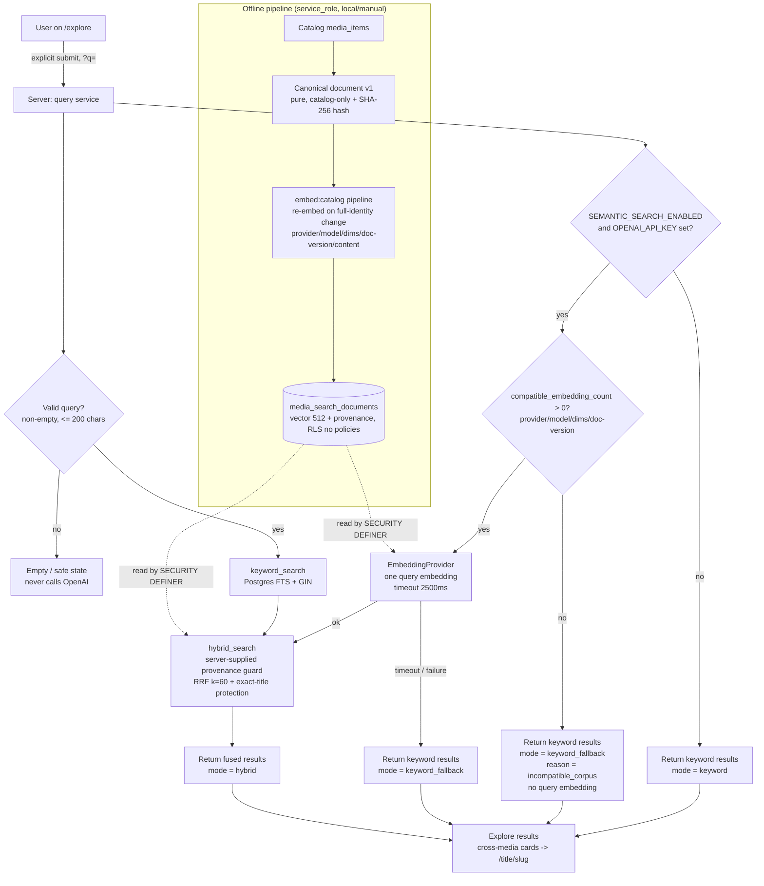

# AI Discovery v1 — system card

> **Status:** documentation for the **AI Discovery v1** hybrid catalog-retrieval
> phase. This card describes a **retrieval** system over Favalog's curated
> catalog. It generates **no** text: every result is a real `media_items` row.
> No live semantic quality numbers are claimed — see
> [Known limitations](#known-limitations) and the note in
> [ADR 0003](./adr/0003-ai-discovery-hybrid-catalog-retrieval.md#note-on-this-environment).

## Intended use

- Help a person **find** curated movies, TV, and books on `/explore` using
  natural-language intent ("cozy space movies", "books about grief") **and**
  keywords/exact titles, over the real Supabase catalog (all **28** curated
  titles).
- Provide a shareable `?q=` search URL with movie / TV / book filters, backed by
  hybrid retrieval (lexical + semantic) with **exact-title protection**.
- Degrade to keyword-only search whenever semantic retrieval is disabled,
  unconfigured, or unavailable — search must never fail the page.

## Non-goals (explicit)

- **No generative AI / LLM-written text.** No summaries, explanations, chat, or
  agents. This is retrieval only.
- **No external catalog ingestion** (TMDB / Open Library / Google Books) and
  **no unbounded corpus** — the corpus is the 28 curated titles.
- **No personalization**: no user taste embeddings, no personalized
  recommendations, no follows/feeds signals.
- **No raw similarity scores shown** to users and **no** presentation of the
  feature as "AI-generated".
- **No client-side embedding** and **no** client-supplied vectors, weights,
  model, dimensions, or SQL — the app generates the trusted query embedding.
- **No automatic remote embedding jobs, hosted Supabase mutations, or
  deployment** in this phase.

## Architecture / data flow

## Data inputs

- **Catalog only.** The embedding input is the versioned **canonical document**
  (`lib/search/canonical-document.ts`, `CANONICAL_DOCUMENT_VERSION = "v1"`): a
  pure, normalized, stable-field-order composition of title, subtitle, kind,
  year, genres, credits (by kind), and synopsis from `media_items`. A stored row
  is treated as **unchanged** only when its **complete embedding identity** —
  content hash, document version, embedding provider, embedding model, embedding
  dimensions, **and** a complete vector — matches what the current run would
  produce; any mismatch (including a fake→OpenAI provider change) is re-embedded
  automatically. Idempotency is preserved: a re-run with the same
  provider/model/dimensions/document-version/content performs zero embedding
  calls and zero writes. A `--force` flag on `npm run embed:catalog` is a
  recovery escape hatch only, never a substitute for this automatic detection.
- **No user data, no secrets, no mock-user attribution** ever enters an
  embedding document.
- **Query input** is the user's search text (string, normalized, non-empty,
  ≤ 200 chars). It is embedded once, server-side, only when semantic is enabled
  and configured; it is **never persisted**.

## Offline evaluation dataset

- A **human-reviewed golden dataset** of representative queries mapped to
  expected catalog titles, defined over the **stable** 28-title corpus (so
  expectations do not drift).
- Includes exact-title queries, paraphrase/intent queries, and per-category
  (movie / TV / book) coverage.
- Drives the harness via `npm run eval:search`.

## Quality metrics + thresholds

| Metric                     | What it measures                                  |
| -------------------------- | ------------------------------------------------- |
| **Recall@5**               | Fraction of expected titles in the top 5          |
| **MRR**                    | Mean reciprocal rank of the first relevant result |
| **Exact-title top-1**      | A direct title query returns that title first     |
| **Zero-result rate**       | Fraction of queries returning nothing             |
| **Per-category breakdown** | The above, split by movie / TV / book             |
| **Latency**                | Keyword / embedding / db / total (live mode only) |

- The harness enforces thresholds and **exits nonzero on a regression**, so a
  quality drop blocks CI. It emits both JSON and human-readable output; the JSON
  report includes the evaluated `identity` (provider / model / dimensions /
  documentVersion), `catalogCount`, `compatibleCorpusCount`, `corpusComplete`,
  and `embeddingTokens`.
- **The harness fails closed in `--live` mode.** Before hybrid evaluation it
  verifies that **every** catalog title has a stored embedding matching the
  active provider / model / dimensions / document version; if any fake, stale,
  incomplete, or incompatible vector remains it **exits nonzero before
  evaluating** rather than reporting live semantic metrics for a mismatched
  corpus.
- **No live semantic numbers are asserted here.** The deterministic secret-free
  mode (fixture rankings via `FakeEmbeddingProvider`) is explicitly a
  **secret-free integration / regression** check of the retrieval plumbing —
  **not** proof of semantic relevance; fake-vector cosine similarity does not
  demonstrate semantic quality. Only a genuine `--live` OpenAI run (gated on a
  local Supabase + `OPENAI_API_KEY`) is evidence of semantic quality, and it
  remains the source of real semantic-quality evidence.

## Known limitations

- Small, curated corpus (28 titles): great for precision and evaluation, but not
  a comprehensive catalog. Out-of-catalog intents simply have no match.
- Semantic quality depends on `text-embedding-3-small` at `dimensions: 512`; the
  Matryoshka truncation trades a little theoretical recall for ~3× smaller
  storage/index. Live impact is unmeasured in this environment.
- Embeddings can go **stale** if the canonical document changes without a
  re-embed. This is now guarded on both sides: `embed:catalog` re-embeds any row
  whose complete embedding identity (content / document version / provider /
  model / dimensions) no longer matches, and the database semantic arm only
  considers rows whose provenance matches the query's — a stale or incompatible
  corpus degrades safely to keyword-only rather than mixing embedding spaces.
- English-oriented full-text configuration; no multilingual handling yet.

## Failure modes

- **OpenAI unconfigured / kill switch off / embedding timeout or error** →
  return keyword results, mode `keyword_fallback`; the page never errors.
- **No compatible embedding corpus** (missing / partial / stale / incompatible —
  the stored provider / model / dimensions / document version do not match the
  active query embedding) → `compatible_embedding_count` detects it **first**, so
  the app stays keyword-only **without paying for a query embedding** and records
  mode `keyword_fallback` with reason `incompatible_corpus`; `hybrid` is never
  claimed unless a compatible semantic corpus was actually used.
- **Supabase entirely unconfigured** → existing no-env public browsing is
  preserved; search reports a controlled unavailable state.
- **Empty / too-long / invalid query** → validated out before any OpenAI call
  (empty never calls OpenAI); a safe empty/error state is shown.
- **Unknown media-kind filter or oversized limit** → allow-listed and
  server-clamped, respectively.
- **Downstream DB error** → mapped to a safe error category; raw errors and
  vectors are never surfaced.

## Privacy considerations

- Raw user query text is **never persisted**.
- Structured logs may include: correlation id, search mode, query **length**,
  embedding model, token count, keyword/embedding/db/total latency, result
  count, a safe error category, and a fallback reason.
- Logs **never** include: the query text itself, tokens/session, user identity,
  API responses, or vectors.
- Raw embedding vectors are never exposed to any client: the embedding table has
  RLS enabled with **no** policies and `anon`/`authenticated` revoked; only the
  `SECURITY DEFINER` search functions read it, returning only safe catalog
  fields + a rank.

## Operational kill switch

- `SEMANTIC_SEARCH_ENABLED` (server-only): a falsey token disables the semantic
  path immediately; **keyword search keeps working**. Default is enabled.
- `OPENAI_API_KEY` (server-only): required only for the semantic path. With no
  key, search runs keyword-only. The key is never `NEXT_PUBLIC_`, never logged,
  never sent to the browser.

## Rollout plan

1. Land the forward-only migrations (catalog enrichment + `search_tsv`/GIN, the
   private embedding table + pgvector, the search functions, and the
   provenance-guarded search migration `20260815120300` — **local-only** / not
   yet hosted) locally.
2. Ship keyword search on `/explore` first — it needs **zero** embeddings and
   works with no OpenAI key.
3. Generate catalog embeddings locally with `npm run embed:catalog` (service
   role, local/manual) and enable the semantic path behind
   `SEMANTIC_SEARCH_ENABLED`.
4. Validate against the golden dataset (`npm run eval:search`) — keyword
   baseline first, then live hybrid on a local stack with `OPENAI_API_KEY`.
5. Deploy migrations to hosted Supabase and configure the server-only secret out
   of band only when the owner chooses to (out of scope for this phase).

## Monitoring plan

- Emit the structured (privacy-safe) log fields above per search, keyed by
  correlation id, to observe search mode mix (`hybrid` / `keyword` /
  `keyword_fallback`), fallback rate, zero-result rate, and latency percentiles.
- Alert on a rising `keyword_fallback` rate (OpenAI degradation) or a rising
  zero-result rate (corpus/enrichment gaps).
- Re-run `npm run eval:search` on catalog or ranking changes; a threshold
  regression fails the build.

## Next experiments

- Live hybrid evaluation with a real `OPENAI_API_KEY` to produce the first
  semantic quality numbers.
- Compare `dimensions: 512` vs. 1536 on the golden dataset.
- Weighted or learned fusion (and a possible cross-encoder re-rank) vs. RRF
  `k = 60`.
- Generalize exact-title protection to aliases / localized titles.
- Only if the corpus grows materially: revisit vector storage (see
  [ADR 0003](./adr/0003-ai-discovery-hybrid-catalog-retrieval.md#conditions-that-would-justify-changing-vector-storage-model-or-ranking)).
