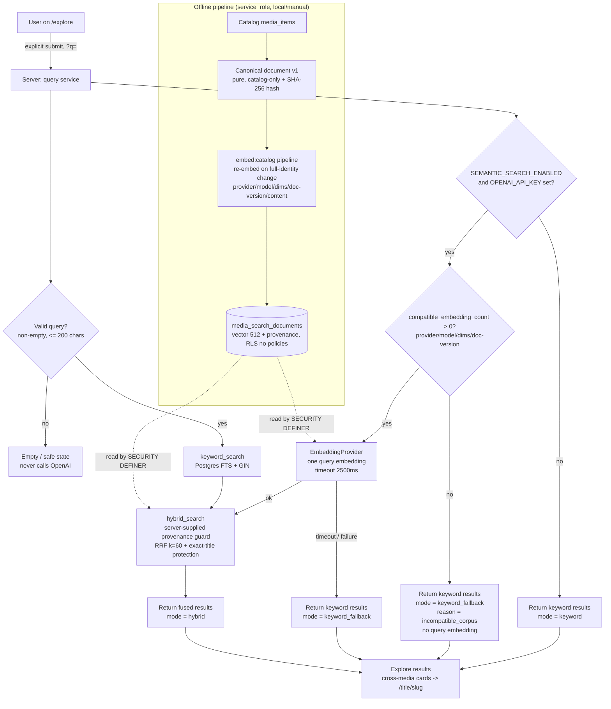

# AI Discovery v1 — system card

> **Status:** documentation for the **AI Discovery v1** hybrid catalog-retrieval
> phase. This card describes a **retrieval** system over Favalog's curated
> catalog. It generates **no** text: every result is a real `media_items` row.
> Real local evaluation results (2026-08-25) are recorded below, and AI
> Discovery v1 is **production-active and verified** as of 2026-08-27 (see
> **Production state**).

## Intended use

- Help a person **find** curated movies, TV, and books on `/explore` using
  natural-language intent ("cozy space movies", "books about grief") **and**
  keywords/exact titles, over the real Supabase catalog (all **28** curated
  titles).
- Provide a shareable `?q=` search URL with movie / TV / book filters, backed by
  hybrid retrieval (lexical + semantic) with **exact-title protection**.
- Degrade to keyword-only search whenever semantic retrieval is disabled,
  unconfigured, or unavailable — search must never fail the page.

## Non-goals (explicit)

- **No generative AI / LLM-written text.** No summaries, explanations, chat, or
  agents. This is retrieval only.
- **No external catalog ingestion** (TMDB / Open Library / Google Books) and
  **no unbounded corpus** — the corpus is the 28 curated titles.
- **No personalization**: no user taste embeddings, no personalized
  recommendations, no follows/feeds signals.
- **No raw similarity scores shown** to users and **no** presentation of the
  feature as "AI-generated".
- **No client-side embedding** and **no** client-supplied vectors, weights,
  model, dimensions, or SQL — the app generates the trusted query embedding.
- **No automatic remote embedding jobs.** Writing the embedding corpus to a
  remote project is never automatic — it is an owner-controlled step gated
  behind explicit guards (see **Production state** below). Production semantic
  search was enabled via one such guarded, owner-run backfill; that guard
  remains the required process for any future production re-embedding.

## Architecture / data flow



## Data inputs

- **Catalog only.** The embedding input is the versioned **canonical document**
  (`lib/search/canonical-document.ts`, `CANONICAL_DOCUMENT_VERSION = "v1"`): a
  pure, normalized, stable-field-order composition of title, subtitle, kind,
  year, genres, credits (by kind), and synopsis from `media_items`. A stored row
  is treated as **unchanged** only when its **complete embedding identity** —
  content hash, document version, embedding provider, embedding model, embedding
  dimensions, **and** a complete vector — matches what the current run would
  produce; any mismatch (including a fake→OpenAI provider change) is re-embedded
  automatically. Idempotency is preserved: a re-run with the same
  provider/model/dimensions/document-version/content performs zero embedding
  calls and zero writes. A `--force` flag on `npm run embed:catalog` is a
  recovery escape hatch only, never a substitute for this automatic detection.
- **No user data, no secrets, no mock-user attribution** ever enters an
  embedding document.
- **Query input** is the user's search text (string, normalized, non-empty,
  ≤ 200 chars). It is embedded once, server-side, only when semantic is enabled
  and configured; it is **never persisted**.

## Offline evaluation dataset

- A **human-reviewed golden dataset** of representative queries mapped to
  expected catalog titles, defined over the **stable** 28-title corpus (so
  expectations do not drift).
- Includes exact-title queries, paraphrase/intent queries, and per-category
  (movie / TV / book) coverage.
- Drives the harness via `npm run eval:search`.

## Quality metrics + thresholds

| Metric                     | What it measures                                  |
| -------------------------- | ------------------------------------------------- |
| **Recall@5**               | Fraction of expected titles in the top 5          |
| **MRR**                    | Mean reciprocal rank of the first relevant result |
| **Exact-title top-1**      | A direct title query returns that title first     |
| **positiveZeroResultRate** | Fraction of positive queries returning nothing    |
| **negativeCleanRate**      | Fraction of negative queries correctly empty      |
| **Per-category breakdown** | The above, split by movie / TV / book             |
| **Latency**                | Keyword / embedding / db / total (live mode only) |

- The harness enforces thresholds and **exits nonzero on a regression**, so a
  quality drop blocks CI. It emits both JSON and human-readable output; the JSON
  report includes the evaluated `identity` (provider / model / dimensions /
  documentVersion), `catalogCount`, `compatibleCorpusCount`, `corpusComplete`,
  and `embeddingTokens`.
- **The harness fails closed in `--live` mode.** Before hybrid evaluation it
  verifies that **every** catalog title has a stored embedding matching the
  active provider / model / dimensions / document version; if any fake, stale,
  incomplete, or incompatible vector remains it **exits nonzero before
  evaluating** rather than reporting live semantic metrics for a mismatched
  corpus.
- **Live semantic numbers (local evaluation, 2026-08-25):** Recall@5 0.921,
  MRR 1.000, exact-title top-1 1.000, positiveZeroResultRate 0.000,
  negativeCleanRate 0.800 (hybrid). Threshold check: PASS. Deterministic
  secret-free mode (fixture rankings via `FakeEmbeddingProvider`) remains the
  secret-free integration / regression check of the retrieval plumbing.

## Known limitations

- Small, curated corpus (28 titles): great for precision and evaluation, but not
  a comprehensive catalog. Out-of-catalog intents simply have no match.
- Semantic quality depends on `text-embedding-3-small` at `dimensions: 512`
  with a relevance cutoff (max cosine distance `0.72`). Local evaluation
  shows a Precision/Recall trade: negativeCleanRate raised to 0.800 at a small
  recall cost (Recall@5 0.947 → 0.921).
- Embeddings can go **stale** if the canonical document changes without a
  re-embed. This is now guarded on both sides: `embed:catalog` re-embeds any row
  whose complete embedding identity (content / document version / provider /
  model / dimensions) no longer matches, and the database semantic arm only
  considers rows whose provenance matches the query's — a stale or incompatible
  corpus degrades safely to keyword-only rather than mixing embedding spaces.
- English-oriented full-text configuration; no multilingual handling yet.

## Failure modes

- **OpenAI unconfigured / kill switch off / embedding timeout or error** →
  return keyword results, mode `keyword_fallback`; the page never errors.
- **No compatible embedding corpus** (missing / partial / stale / incompatible —
  the stored provider / model / dimensions / document version do not match the
  active query embedding) → `compatible_embedding_count` detects it **first**, so
  the app stays keyword-only **without paying for a query embedding** and records
  mode `keyword_fallback` with reason `incompatible_corpus`; `hybrid` is never
  claimed unless a compatible semantic corpus was actually used.
- **Supabase entirely unconfigured** → existing no-env public browsing is
  preserved; search reports a controlled unavailable state.
- **Empty / too-long / invalid query** → validated out before any OpenAI call
  (empty never calls OpenAI); a safe empty/error state is shown.
- **Unknown media-kind filter or oversized limit** → allow-listed and
  server-clamped, respectively.
- **Downstream DB error** → mapped to a safe error category; raw errors and
  vectors are never surfaced.

## Privacy considerations

- Raw user query text is **never persisted**.
- Structured logs may include: correlation id, search mode, query **length**,
  embedding model, token count, keyword/embedding/db/total latency, result
  count, a safe error category, and a fallback reason.
- Logs **never** include: the query text itself, tokens/session, user identity,
  API responses, or vectors.
- Raw embedding vectors are never exposed to any client: the embedding table has
  RLS enabled with **no** policies and `anon`/`authenticated` revoked; only the
  `SECURITY DEFINER` search functions read it, returning only safe catalog
  fields + a rank.

## Operational kill switch

- `SEMANTIC_SEARCH_ENABLED` (server-only): a falsey token disables the semantic
  path immediately; **keyword search keeps working**. Default is enabled.
- `OPENAI_API_KEY` (server-only): required only for the semantic path. With no
  key, search runs keyword-only. The key is never `NEXT_PUBLIC_`, never logged,
  never sent to the browser.

## Production state (2026-08-27)

AI Discovery v1 is **production-active and verified**. Production semantic
retrieval is **enabled and working** on Vercel: hybrid search runs over the
hosted catalog and still degrades safely to keyword-only on any semantic
failure.

- **Schema/functions:** all 23 migrations through `20260815120400` — including
  the forward-only AI Discovery migrations (catalog enrichment +
  `search_tsv`/GIN `20260815120000`, the private embedding table + pgvector
  `20260815120100`, the search functions `20260815120200`, the
  provenance-guarded search migration `20260815120300`, and the semantic
  relevance cutoff `20260815120400`) — are **applied to hosted Supabase** (the
  hosted migration ledger contains them). Application commit `2c9ab54` is
  **deployed to Vercel production** (status Ready); the current repository tip
  includes commits `77790be` and `d9453e5`.
- **Hosted embedding corpus is populated.** The guarded, owner-controlled
  OpenAI backfill (below) **completed successfully**, so
  `public.media_search_documents` now holds a complete, compatible embedding
  corpus for the catalog (provider `openai`, model `text-embedding-3-small`,
  `dimensions: 512`, document version `v1`). The read-only hosted corpus,
  provenance, compatible-corpus (`compatible_embedding_count` for that exact
  provenance, matching the 28-title catalog), security, and idempotency checks
  **all returned their documented expected results**.
- **Resolved incident (superseded).** An earlier accidental hosted **fake**-
  embedding write occurred and was **cleaned up before** the guarded real
  backfill, so no placeholder vectors remained when the OpenAI corpus was
  written. The remote-write guard (below) was added in response and **remains
  the required process** for any future production re-embedding.
- **Production browser verification (2026-08-27).** On the deployed `/explore`,
  the intent query `a thoughtful sci-fi story about memory and grief` returned
  relevant catalog results, and the out-of-catalog query `how to file my income
taxes online this year` returned zero results with the controlled
  "No matches yet" state.
- **Four verification layers stay distinct:**
  - _Local deterministic (fake) evaluation_ — a secret-free integration /
    regression check of the retrieval plumbing, **not** proof of semantic
    quality.
  - _Local live evaluation (2026-08-25)_ — the documented semantic-quality
    metrics (Recall@5 0.921, MRR 1.000, exact-title top-1 1.000,
    positiveZeroResultRate 0.000, negativeCleanRate 0.800, hybrid; threshold
    check PASS), measured locally against a local stack.
  - _Hosted database verification (2026-08-27)_ — the read-only hosted corpus /
    provenance / compatible-corpus / security / idempotency checks above, all
    returning their documented expected results.
  - _Production browser verification (2026-08-27)_ — the two live `/explore`
    queries above on the deployed app.
- **Future re-embedding still requires the owner-controlled guarded backfill:**

  ```bash
  # With OPENAI_API_KEY set and the remote Supabase URL resolved:
  npm run embed:catalog -- --allow-remote --confirm-project-ref=<ref>
  ```

  The embedding CLI classifies the resolved Supabase URL as local vs. remote
  and hardens remote writes: a remote `--fake` write always fails (even with
  `--force`), and a remote **live** write fails unless the operator passes
  **both** `--allow-remote` **and** `--confirm-project-ref=<exact-project-ref>`
  matching the project reference in the resolved URL. `--force` never bypasses
  the remote guard; remote dry runs stay write-free and clearly label the
  remote target; local writes keep their current behavior; authorization is
  never inferred from a service key being present; keys and vectors are never
  logged.

## Rollout plan

1. Land the forward-only migrations (catalog enrichment + `search_tsv`/GIN, the
   private embedding table + pgvector, the search functions, and the
   provenance-guarded search migration `20260815120300`) locally, then apply
   them to hosted Supabase — **done**: all 23 migrations through
   `20260815120400` are hosted.
2. Ship keyword search on `/explore` first — it needs **zero** embeddings and
   works with no OpenAI key.
3. Generate catalog embeddings locally with `npm run embed:catalog` (service
   role, local/manual) and enable the semantic path behind
   `SEMANTIC_SEARCH_ENABLED`.
4. Validate against the golden dataset (`npm run eval:search`) — keyword
   baseline first, then live hybrid on a local stack with `OPENAI_API_KEY`.
5. Enable production semantic search: run the guarded remote backfill (above)
   with the server-only secret configured out of band, then re-verify —
   **done (2026-08-27)**. Production now serves hybrid results and still falls
   back to keyword-only on any semantic failure. Any future re-embedding must
   repeat this owner-controlled guarded step.

## Monitoring plan

- Emit the structured (privacy-safe) log fields above per search, keyed by
  correlation id, to observe search mode mix (`hybrid` / `keyword` /
  `keyword_fallback`), fallback rate, zero-result rate, and latency percentiles.
- Alert on a rising `keyword_fallback` rate (OpenAI degradation) or a rising
  zero-result rate (corpus/enrichment gaps).
- Re-run `npm run eval:search` on catalog or ranking changes; a threshold
  regression fails the build.

## Next experiments

- Hosted evaluation of production semantic search against the golden dataset
  (the first live semantic-quality numbers were produced locally on 2026-08-25;
  production is now activated and browser-verified as of 2026-08-27).
- Compare `dimensions: 512` vs. 1536 on the golden dataset.
- Weighted or learned fusion (and a possible cross-encoder re-rank) vs. RRF
  `k = 60`.
- Generalize exact-title protection to aliases / localized titles.
- Only if the corpus grows materially: revisit vector storage (see
  [ADR 0003](./adr/0003-ai-discovery-hybrid-catalog-retrieval.md#conditions-that-would-justify-changing-vector-storage-model-or-ranking)).
