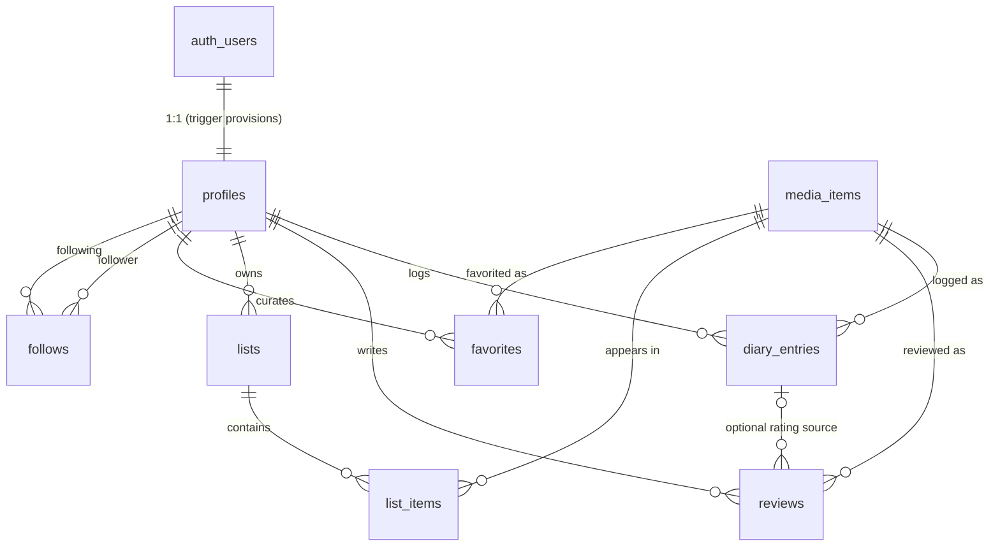

# Backend architecture

> **Status:** infrastructure established, authentication wired, and the full
> persistent diary-entry lifecycle live. Authentication + onboarding and
> **title logging** — create (Log / Rate / Review → the atomic
> `public.log_media(...)` RPC), **edit** (`public.update_diary_entry(...)`), and
> **delete** (`public.delete_diary_entry(...)`) — are wired to Supabase. An
> authenticated user's `/title/[slug]` personal state, real `/diary`, and real
> `/profile/[username]` (derived statistics, recent titles, and reviews) read
> from Supabase, and the owner gets edit/delete controls on the title's personal
> state and each real diary row; signed-out / no-env visitors keep a clearly
> labelled mock **example** diary (no edit/delete) and mock demo profiles, and
> the title's primary action is a neutral **Log** (never a personalized
> "Watched"/"Read"). The **persistent list lifecycle** — sign in → create a list
> → add a title → view the real list → see it on the owner's profile →
> add/remove titles → **edit list metadata** → **delete a whole list**
> (`public.create_list` / `add_list_item` / `remove_list_item` /
> `update_list` / `delete_list`, server-generated globally-unique immutable
> slugs, `public`/`private` visibility) — is now **wired end-to-end** through
> the database + server layer (`lib/supabase/lists.ts`, `app/lists/actions.ts`)
> and UI under `components/lists/` (real **Add to list** dialog on
> `/title/[slug]`, real "Your lists" + "Community lists" and a "Create list"
> launcher on `/lists`, real `/list/[slug]` detail with owner-only per-item
> removal and owner-only edit/delete list controls, and a real **Lists** section
> on `/profile/[username]`). All **25** migrations through
> `20260815120600` — including the **17th** (edit/delete lists), the **18th**
> (favorites), the **19th–22nd** (AI Discovery retrieval), the **23rd**
> (semantic cutoff), the **24th** (external-ingestion provenance columns), and
> the **25th** (canonical `media_external_ids` alias table) — are **applied to
> hosted Supabase** (the hosted migration ledger contains them), and commit
> `2c9ab54` is **deployed to Vercel
> production** (status Ready; the current repository tip includes commits
> `77790be` and `d9453e5`). The AI Discovery v1 system (hybrid search over the
> **28** curated titles) has been **evaluated locally** with a live OpenAI run
> (2026-08-25): Recall@5 0.921, MRR 1.000, exact-title top-1 1.000,
> positiveZeroResultRate 0.000, negativeCleanRate 0.800 (hybrid) — these
> **local** results remain the documented evidence of semantic quality.
> **AI Discovery v1 is production-active and verified (2026-08-27):** the
> owner-controlled guarded OpenAI backfill completed successfully, so the hosted
> embedding corpus (`public.media_search_documents`) now holds a complete,
> compatible corpus (provider `openai`, model `text-embedding-3-small`,
> `dimensions: 512`, document version `v1`) matching the hosted production
> catalog (**29** titles — the 28 curated titles plus the imported Open Library
> Work `OL893414W`) — an earlier accidental hosted fake-embedding write was
> **cleaned up before** the real backfill — so `compatible_embedding_count > 0`
> and production serves
> hybrid results, still degrading to keyword-only on any semantic failure. The
> read-only hosted corpus / provenance / compatible-corpus / security /
> idempotency checks all returned their documented expected results, and browser
> verification passed on the deployed `/explore` (a sci-fi intent query returned
> relevant results; an out-of-catalog query returned the controlled
> "No matches yet" state). The remote-write guard remains the required process
> for any future production re-embedding (see ADR 0003). The
> remaining product surfaces (catalog browsing, community reviews) still run on
> the typed mock-data layer (`@/lib/data`), and **reordering, curator notes, list
> likes, follower-aware visibility, direct favorite-removal from the profile, and
> follows are deferred**. The generated types
> (`lib/database.types.ts`) are real and drift-checked; the local catalog
> migration owns all **28** curated titles (hosted production additionally
> contains the imported Open Library Work `OL893414W`, for **29** titles);
> `seed.sql` references that catalog and is **local-only**. The app still builds
> with no Supabase env set.

This document describes the Supabase/PostgreSQL foundation added in Phase 2:
why it exists, the schema, the security model, and the boundaries that keep the
existing architecture intact.

## Why Supabase / PostgreSQL

Favalog needs authentication, a per-user persistence layer, and eventually a
real media catalog. Supabase provides managed PostgreSQL, authentication,
Row Level Security (RLS), auto-generated APIs, and TypeScript type generation
with a first-class local development story via the Supabase CLI. That lets us:

- keep the data model in **plain SQL migrations** (portable, reviewable, and not
  locked to an ORM);
- push authorization **into the database** with RLS rather than trusting
  application code;
- develop and test the whole stack locally with the CLI (no cloud dependency
  for ordinary work).

See [ADR 0001](./adr/0001-supabase-backend.md) for the decision, alternatives,
and consequences.

## Schema overview

All application tables live in the `public` schema. Migrations under
`supabase/migrations/` are the **single source of truth** — the database is
never edited out of band.

| Table           | Purpose                                             |
| --------------- | --------------------------------------------------- |
| `profiles`      | Public identity, 1:1 with `auth.users`              |
| `media_items`   | Unified catalog of movies / TV / books              |
| `diary_entries` | Chronological per-user log events (watched / read)  |
| `reviews`       | Long-form reviews, optionally tied to a diary entry |
| `lists`         | User-authored cross-media collections               |
| `list_items`    | Ordered membership of media in a list               |
| `favorites`     | A user's ordered, cross-media favorites shelf       |
| `follows`       | Directed follower → following relationships         |

### Enums

PostgreSQL enums are used only for stable, bounded domains:

- `media_kind` — `movie | tv | book`
- `list_visibility` — `public | followers | private`

Values expected to evolve (genres, review moods, etc.) are **not** enums.

### Keys, constraints, and indexes

- **UUID primary keys** (`gen_random_uuid()`) everywhere except `follows`,
  which uses a composite `(follower_id, following_id)` primary key.
- **Unique identity:** `media_items (source, external_id)` and a unique `slug`;
  `profiles.username` unique **case-insensitively** (via `citext`);
  `lists (user_id, slug)`; `list_items (list_id, media_id)` and
  `(list_id, position)`; `favorites (user_id, media_id)` and
  `(user_id, position)`.
- **Check constraints:** half-star rating ranges (0.5–5.0) on
  `diary_entries.rating` and `reviews.rating`; username format; slug format;
  non-negative positions; `follows` self-follow prevention; and a
  rating-source-of-truth guard on `reviews`.
- **Indexes** cover the real access patterns: media by `kind`/`year`, a GIN
  index on `genres`, diary by `(user_id, logged_at desc)`, reviews by
  `(media_id, created_at desc)` and `(user_id, created_at desc)`, list/favorite
  ownership, and the follows reverse lookup.
- **Timestamps:** every table carries `created_at`; every mutable table also
  carries `updated_at`, kept fresh by the shared `public.set_updated_at()`
  trigger function (pinned `search_path`, no elevated privileges).

### ER diagram



## Ownership relationships

- A `profiles` row is owned by the auth user with the same `id`.
- `diary_entries`, `reviews`, `lists`, and `favorites` are owned by
  `user_id`.
- `list_items` are owned transitively: a user owns a list item when they own
  its parent `lists` row.
- A `follows` row is written only by the `follower_id`.

## RLS strategy

RLS is **enabled on every public application table**. Policies are explicit and
least-privilege; there are deliberately no `using (true) with check (true)`
policies for user-owned writes.

**Public read** (`select using (true)` or a visibility check):

- `media_items`, `profiles`, `reviews`, `diary_entries`, `favorites`, `follows`
- `lists` — only when `visibility = 'public'`, plus the owner always sees their
  own lists
- `list_items` — readable when the parent list is readable

**Owner write** (`auth.uid()` checks on INSERT / UPDATE / DELETE):

- profile owner (`profiles.id`)
- diary-entry / review / list / favorites owner (`user_id`)
- follow relationship creator (`follower_id`)
- `list_items`: writable only when the caller owns the parent list (enforced by
  an `EXISTS` sub-select against `lists`)

**Catalog writes** (`media_items`) have **no** anon/authenticated write policy.
They are performed exclusively by trusted server-side processes using the
**secret (service-role) key**, which bypasses RLS. Privileged writes are never
exposed to a browser client.

`UPDATE` policies always pair a `using` (row visibility) clause with a
`with check` (post-image) clause.

### Public-read decisions and deferred visibility

- **Diary entries are publicly readable.** They back the public-profile
  concept. If per-entry privacy is introduced later, add a privacy column and
  tighten the SELECT policy.
- **`followers` and `private` lists are treated as private** for now: a list is
  publicly readable only when `visibility = 'public'`. Real followers-only
  access is **not faked** — it will be added once the `follows` relationship
  powers a proper policy (a `followers` list becomes readable when
  `EXISTS (select 1 from follows where following_id = lists.user_id and
follower_id = auth.uid())`).

## Ratings source of truth

To avoid representing the same rating inconsistently:

- `diary_entries.rating` records the user's rating **at log time** and is the
  source of truth for a logged event.
- A `reviews` row that references a `diary_entry_id` **must not** carry its own
  `rating` (enforced by a check constraint); its displayed rating resolves from
  the linked diary entry.
- A **standalone** review (no `diary_entry_id`) may carry its own `rating`, so
  an opinion can exist without a formal log event.

## Likes / activity — deferred by design

- **Likes.** The UI shows presentation-only like counts on reviews and lists.
  No `review_likes` / `list_likes` tables are added yet; those counts remain
  mock values until a dedicated persistence task, at which point they can be
  modeled securely (owner-scoped rows + a derived count).
- **Activity.** No generic `activity` table is created. The social feed and
  profile activity are **derivable** from diary entries, reviews, list
  create/update, favorites, and follows. A dedicated event table becomes
  justified only if/when derivation becomes too expensive (e.g. a high-volume
  fan-out feed needing precomputed timelines) — deferred until then.

## Catalog strategy

`media_items` is a unified table for all three media kinds. Commonly queried
fields are normal columns; kind-specific fields live in a `details` JSONB
payload validated at the mapping boundary. A `source` column marks provenance
(`favalog` for curated/internal seed rows) and `(source, external_id)` is the
unique external identity, so a real provider (TMDB, Open Library, Google Books,
…) can be ingested later **without a schema change** and **without** committing
to any provider now.

## Generated types & the domain boundary

- `lib/database.types.ts` is the **database** representation. It is produced by
  `npm run supabase:types` (`supabase gen types typescript --local`). It must
  not be hand-maintained once generation can run.
  > It is now **genuinely generated** from the local stack and guarded by a
  > secret-free **type-drift check** (regeneration must produce no diff).
  > Regenerate only when the schema actually changes; never hand-format it.
- `lib/types.ts` remains the **framework-agnostic domain model** used by the UI.
  Generated row types do **not** replace it.
- `lib/supabase/mappers.ts` is the boundary: it maps `media_items` rows onto the
  `MediaItem` union. It is a small proof of concept (with tests), not a full
  repository layer — building fetchers/repositories is future work.

```
Postgres row  ──(lib/database.types.ts)──▶  mapper  ──▶  domain model (lib/types.ts)  ──▶  UI
```

## Persistent diary-entry lifecycle (create / edit / delete) and reads

The persistent product loop is the full title **log lifecycle**. All three
write paths are narrowly-scoped RPCs that share one security model:
`SECURITY INVOKER` (so RLS is a second, independent boundary), a pinned
`search_path = ''` with fully-qualified objects, ownership derived from
`auth.uid()` (never a client `user_id`), EXECUTE granted to `authenticated`
only (revoked from `public`/`anon`), and a return payload limited to the
identifiers the app needs (no privileged/unrelated row data). A diary-linked
review always stores `rating = null`; the diary entry owns the rating
(half-step 0.5–5.0, validated in the RPC and by the table CHECK).

- **Create.** `public.log_media(...)` (migration `20260806160200`) atomically
  creates a `diary_entries` row and, when a non-empty review body is supplied,
  a linked `reviews` row in one transaction. It resolves the title from a
  trusted **slug** server-side (the browser never supplies media metadata).
- **Edit.** `public.update_diary_entry(p_diary_entry_id, …)` (migration
  `20260812164500`) updates the caller's **own** entry and its optional linked
  review in one transaction: it changes the logged date, rating (passing `null`
  **removes** an existing rating), and revisit flag, and **upserts** the linked
  review — creating one when the entry had none, updating it in place
  otherwise, or **removing** it when the review body is cleared (the diary entry
  is retained). A missing or cross-user id resolves to no row and fails safely
  (`P0002`). Returns `{ diary_entry_id, review_id, media_slug }`.
- **Delete.** `public.delete_diary_entry(p_diary_entry_id)` (migration
  `20260812164500`) deletes the caller's **own** entry. Because
  `reviews.diary_entry_id` is `ON DELETE SET NULL` (which would _detach_ rather
  than remove a linked review), the function deletes the caller's linked
  review(s) **explicitly first**, then the entry — atomically, leaving **no
  orphan**. Deleting the newest log lets the previous log (if any) become the
  title's latest personal state, because reads resolve the newest remaining
  entry. Returns `{ diary_entry_id, media_slug }`.
- **Application boundary.** `lib/supabase/log.ts` hosts all three server entry
  points — `logMedia`, `updateDiaryEntry`, and `deleteDiaryEntry`. Each refuses
  to run without Supabase configured, re-validates the user via the auth DAL,
  re-validates/normalizes input (`lib/supabase/log-input.ts`:
  `validateLogInput` / `validateEditInput`, plus a UUID check for delete), calls
  the RPC, and maps any error to a safe message via the pure
  `lib/supabase/log-errors.ts` (`mapLogError` / `mapEditError` /
  `mapDeleteError` — raw DB detail is never surfaced). A success **must** carry
  a non-empty `diary_entry_id`; a malformed/absent RPC identifier becomes a
  generic error rather than a false success. Each then revalidates `/diary`, the
  title route, and the author's `/profile/[username]` (slug from the RPC's
  server-resolved catalog identity, username from the DAL — never the client)
  via the shared `revalidateDiaryWrite` helper.
- **Server Actions.** `app/title/[slug]/actions.ts` (`logTitleAction`) is the
  create boundary; `app/diary/actions.ts` (`editDiaryEntryAction` /
  `deleteDiaryEntryAction`) are the edit/delete boundaries shared by the diary
  and title UIs. Each reads only allow-listed fields (never a user id, media
  UUID, username, or ownership field — see `app/title/[slug]/log-form.ts` and
  `app/diary/diary-form.ts`), independently re-checks authentication and profile
  completeness, routes signed-out / incomplete cases through the safe `returnTo`
  flow, and returns a serializable state for `useActionState`. They do not
  duplicate the RPC call.
- **UI.** The shared, presentational `LogDialog` (create or edit mode, its
  action injected as a prop so it never imports a server module) and
  `DeleteLogDialog` back the owner controls on the title's personal-state area
  (`MediaActions`) and each real diary row (`DiaryEntryActions`). Edit opens
  pre-filled from the stored entry; delete requires an explicit second-step
  confirmation. These controls render only for the authenticated owner — never
  signed-out or on the example diary.
- **Reads.** `lib/supabase/diary.ts` provides `getMyLatestLogForSlug` (the
  title's per-viewer personal state, now including the linked review's
  title/body/spoiler flag so an edit can pre-fill) and `getMyDiary` (the
  authenticated user's diary as `DiaryEntryView[]`, each real row carrying an
  owner-only `edit` payload). `lib/supabase/profile-activity.ts`
  (`getRealProfileActivity`) derives a real profile's statistics, recent
  titles, and reviews. All embed related rows (no N+1), map through the
  mapper/view-model boundary, and resolve a linked review's effective rating
  from its diary entry.

### Mock vs. real boundary

- `/diary`: authenticated + configured → real diary; signed-out or no-env →
  clearly labelled mock **example** diary (never attributed to the visitor); a
  query error → safe error state (no silent mock fallback).
- `/profile/[username]`: mock demo usernames render full mock profiles; other
  usernames resolve to a real profile with derived activity; unknown →
  `notFound()`. A real profile never inherits mock data, and real reviews show
  no fabricated like counts.

## Persistent list lifecycle (create / add / remove / edit / delete) and reads

The persistent **list** lifecycle — sign in → create a list → add a title →
view the real list → see it on the owner's profile → add/remove other titles →
edit list metadata → delete a whole list — is backed by narrowly-scoped RPCs
that share the **same** security model as the diary RPCs: `SECURITY INVOKER`
(RLS is an independent second boundary), a pinned `search_path = ''` with
fully-qualified objects, ownership derived from `auth.uid()` (never a client
`user_id`), EXECUTE granted to `authenticated` only (revoked from
`public`/`anon`), catalog identity resolved server-side from a trusted **slug**,
and a return payload limited to the identifiers/routing data the app needs.

### Route identity: globally-unique server-generated slugs

`/list/[slug]` must resolve to **exactly one** list, but `lists.slug` was
originally unique only **per owner** (`lists_user_id_slug_key`). Migration
`20260814160000_list_slug_global_unique.sql` adds a forward-only **global**
unique index `lists_slug_global_key on lists (slug)` (strictly stricter than the
per-owner index, which is kept — migrations are immutable). A `DO` guard makes
the migration **fail loudly** with a descriptive message if unexpected duplicate
slugs already exist across owners (none are expected, because persistent list
creation was never previously exposed).

Slugs are generated **server-side** by `create_list` from a readable base
(`<username>-<title>`, slugified) plus a deterministic numeric suffix on
collision. Uniqueness is enforced by the **INSERT** (retry-on-`unique_violation`
with a bumped suffix), which is correct even against other users' private-list
slugs that RLS would hide from a pre-`SELECT`. A slug is **immutable**: renaming
a list later never changes its URL, and the browser never supplies a slug.

### The three RPCs (`20260814160100_list_rpcs.sql`)

- **Create.** `public.create_list(p_title, p_description, p_is_ranked,
p_visibility, p_media_slug)` inserts a list owned by the caller with a
  generated slug, validates the title (1–150) / description (≤2000) for clean
  mapped errors, accepts **only** `public` / `private` visibility (the enum's
  `followers` and the domain-only `unlisted` are rejected), and — when an
  optional trusted `p_media_slug` is supplied — adds that title at position 0 in
  the **same transaction** (so "create a list from the title dialog" is atomic).
  Returns `{ list_id, slug, added_media_slug }`.
- **Add.** `public.add_list_item(p_list_id, p_media_slug)` appends a trusted
  catalog title to a list the caller owns. It **locks the parent list row**
  (`for update`) so concurrent adds cannot collide, appends at the next
  contiguous zero-based position, is **idempotent** (an already-present title
  returns `{ already_present: true }` with its existing position — never a
  duplicate or a raw unique-constraint error), and bumps the list's
  `updated_at`. Returns `{ list_id, slug, media_id, position, already_present }`.
- **Remove.** `public.remove_list_item(p_list_id, p_media_slug)` removes a title
  from a list the caller owns, then **compacts** the remaining positions to a
  contiguous `0..n-1` range. Compaction parks rows at a temporary **positive**
  offset above the current max (never negative — the `list_items` non-negative
  CHECK — and disjoint from both the old and new ranges, so no ordering can
  cause a transient `(list_id, position)` duplicate). Removing an absent title
  is idempotent (`{ removed: false }`). Returns
  `{ list_id, slug, media_id, removed }`.

A missing/cross-user `p_list_id` resolves to no owned row and fails safely
(`P0002`); an unknown media slug fails safely (`P0002`); an unauthenticated
caller is rejected both by the grant and by an in-function `auth.uid()` guard
(`28000`).

### List management (`20260814160200_edit_delete_list_rpcs.sql`)

> **Hosted and production-verified.** This is the **17th** migration. All 17
> migrations through `20260814160200` are deployed and verified on hosted
> Supabase; edit/delete list behavior, immutable-slug edits, and the
> authoritative post-delete redirect to `/lists` (the former list URL correctly
> becomes not-found; commit `53eac02` fixed the client-navigation race) are live.

Two additional RPCs extend the list lifecycle. They use the **same** security
model as the create/add/remove RPCs: `SECURITY INVOKER`, `set search_path = ''`
with fully schema-qualified objects, ownership from `auth.uid()` (no client
`user_id` / username / slug / owner / timestamp), `raise` on null `auth.uid()`,
`revoke all ... from public` and `from anon`, `grant execute ... to
authenticated`. Unknown or cross-owner ids fail safely (`P0002`) without
disclosing private-list existence. Both return identifiers only:
`{ list_id, slug, media_slugs }` (`media_slugs` = the list's member catalog
slugs, captured for revalidation — on delete, captured **before** the row is
removed).

- **Update.** `public.update_list(p_list_id uuid, p_title text, p_description
text default null, p_is_ranked boolean default false, p_visibility text
default 'public')` edits title / description / `is_ranked` / visibility of a
  list the caller owns. The **slug is never changed** (immutable canonical URL).
  Only `'public'` / `'private'` visibility is accepted (`'followers'` rejected).
  A blank description normalizes to `NULL`. Toggling `is_ranked` **preserves**
  existing item order/positions (the RPC never touches `list_items`);
  `updated_at` is refreshed by the existing `lists_set_updated_at` trigger.
- **Delete.** `public.delete_list(p_list_id uuid)` deletes the whole list the
  caller owns. `list_items.list_id` is `ON DELETE CASCADE`, so items are removed
  automatically (no orphan, no explicit child delete).

### Visibility reconciliation

The DB enum `list_visibility` is `public | followers | private`; the domain
`ListVisibility` in `lib/types.ts` was `public | unlisted | private`. These are
reconciled: `ListVisibility` now matches the enum (`public | followers |
private`), and a new `ListCreateVisibility` (`public | private`) is the only set
a user may choose this phase. `followers` remains represented but unenforced
until follower-aware access exists.

### Application boundary

- `lib/supabase/lists.ts` hosts the server entry points. Writes (`createList`,
  `addListItem`, `removeListItem`, `updateList`, `deleteList`) mirror `log.ts`:
  refuse to run when Supabase is unconfigured (`unavailable`), independently
  re-check the authenticated user **and a complete onboarded profile** via the
  auth DAL, re-validate/normalize input (`lib/supabase/list-input.ts` —
  including pure `validateUpdateListInput` / `validateDeleteListInput`), call
  the RPC, treat a missing/malformed RPC identifier (id or slug) as a failure
  (never a false success), map errors to safe messages
  (`lib/supabase/list-errors.ts` — `mapUpdateListError` / `mapDeleteListError`;
  raw DB detail never surfaced), and revalidate `/lists`, the real
  `/list/[slug]` (by the RPC's canonical slug), every member `/title/[slug]`
  (add-to-list membership UI; from returned `media_slugs`), and the author's
  `/profile/[username]` (username from the DAL — never the client). Reads
  (`getMyListsWithMembership`, `getMyLists`, `getPublicLists`,
  `getRealListBySlug`, `getRealListsForUser`) are owner/visibility-scoped by RLS
  and return serializable view models via the pure
  `lib/supabase/list-view-model.ts` mappers — never raw rows, and never a
  fabricated like count or curator note on a real list.
- **Server Actions.** `app/lists/actions.ts` (`createListAction`,
  `addListItemAction`, `removeListItemAction`, `editListAction`,
  `deleteListAction`) are the only Client-callable entry points. Each reads only
  allow-listed fields (never a user id, media UUID, username, position, or
  ownership field — see `app/lists/list-form.ts`, including serializable
  `EditListFormState` / `DeleteListFormState`), routes signed-out /
  incomplete-profile cases through the safe `returnTo` / onboarding flow, and
  returns a serializable `useActionState` state. They do not duplicate the RPC
  call. Controlled `unavailable` behavior is preserved when Supabase is not
  configured.
- **Create-result echo.** So the Add-to-list dialog can fold a newly created
  list straight into its membership view without a round-trip, `createList`
  success additionally echoes the caller's **own submitted summary**
  (title / visibility / `isRanked`) through the action layer
  (`CreateListResult` in `lib/supabase/lists.ts`, `CreateListFormState` in
  `app/lists/list-form.ts`, `app/lists/actions.ts`). The RPC itself still
  returns identifiers only — the echoed summary is the request's own input,
  never additional privileged row data.

### UI layering

All Supabase reads stay in server-only modules and Server Components; the
interactive pieces are presentational Client Components that receive a Server
Action as a prop (so Storybook never imports a `"use server"` module), and there
is no client-side Supabase, `localStorage` membership, or `getSession`-based
rendering. New UI lives under `components/lists/`:

- **Pure helpers.** `real-list-format.ts` (visibility / count / date formatting,
  plus `toCreateVisibility` reconciling stored `followers` → `private` for the
  edit form) and `real-list-poster.tsx` (poster with a deterministic fallback when
  `posterUrl` is empty) carry no data-layer knowledge.
- **Cards & sections.** `real-list-card.tsx` renders a real list; the
  server-rendered `real-lists-sections.tsx` composes the signed-in **Your lists**
  (`getMyLists`) and strictly-`public` **Community lists** (`getPublicLists`)
  sections on `/lists`, kept separate from the curated mock sections.
- **Create.** `create-list-form.ts` + `create-list-form.tsx` drive the create
  form; `create-list-dialog.tsx` and `create-list-launcher.tsx` present it in the
  `/lists` header (signed-out → sign-in link with `returnTo=/lists`; no-env →
  controlled unavailable).
- **Add to list.** `add-to-list-dialog.tsx` (loaded from
  `getMyListsWithMembership(slug)` in `app/title/[slug]/page.tsx` via
  `components/media/media-actions.tsx`) toggles idempotent add/remove per owned
  list, offers an inline create-list that creates + adds atomically
  (`mediaSlug`), links to the affected list on success, and shows a controlled
  unavailable state when the catalog slug is unknown (`mediaKnown: false`) or a
  read fails.
- **Detail & removal.** `real-list-detail.tsx` + `real-list-items.tsx` render a
  real `/list/[slug]`; `remove-list-item-dialog.tsx` is the owner-only per-item
  removal confirmation (naming both title and list); `share-list-button.tsx`
  preserves Share without any Like control.
- **Edit & delete list.** Owner-only controls on real `/list/[slug]` via
  `real-list-owner-actions.tsx`: `edit-list-dialog.tsx` + `edit-list-form.tsx`
  (prefilled, action-injected; successful edit keeps the user on the immutable
  canonical URL and refreshes) and `delete-list-dialog.tsx` (deliberate
  confirmation naming the list + a naming checkbox gating the destructive
  button; on success navigates to `/lists`). `toCreateVisibility` in
  `real-list-format.ts` reconciles stored `followers` to `private` for the edit
  form. These controls never show to signed-out visitors, non-owners, or
  mock-list viewers. Share behavior is unchanged.

### Ordering, likes, notes — deferred

Title membership still supports **append** and **remove** only (new titles
append; removal compacts). Ranked lists display their stored order as a ranking;
unranked lists still preserve deterministic order; toggling ranked/unranked does
not reorder items. **Drag-and-drop / arbitrary reordering, curator-note
creation/editing, list likes, and follower-aware visibility remain deferred.**
List metadata editing and whole-list deletion are implemented (see above). Real
lists carry no persisted like count (honestly absent, never faked).

### Mock vs. real list boundary

The curated mock discovery experience on `/lists` is retained but labelled as
editorial/example content; a configured environment additionally surfaces the
signed-in user's **real** lists and a strictly-`public` **community** section.
Existing mock demonstration lists on `/list/[slug]` and mock demo profiles keep
using mock list data; a **real** list/profile never inherits mock lists, counts,
owners, notes, or likes. A read failure shows a controlled error state rather
than silently substituting mock lists as the user's own.

## Persistent favorites loop (add / remove) and reads

The persistent **favorites** loop — sign in → favorite a title on
`/title/[slug]` → see the ordered shelf on the owner's real
`/profile/[username]` → unfavorite it again — is backed by **one** narrowly-scoped
RPC that shares the **same** security model as the diary and list RPCs:
`SECURITY INVOKER` (RLS is an independent second boundary), a pinned
`search_path = ''` with fully-qualified objects, ownership derived from
`auth.uid()` (never a client `user_id` / `media_id` / username / position /
ownership field), catalog identity resolved server-side from a trusted **slug**,
and a return payload limited to the identifiers and resulting state the app
needs (never profile details).

### Table & RLS (pre-existing)

The favorites shelf table and its policies predate this loop, from
`20260805150600_favorites_follows.sql` and `20260805150700`:

- `public.favorites (id, user_id, media_id, position >= 0, created_at)` with a
  unique `(user_id, media_id)` (at most one favorite per title) and a unique
  `(user_id, position)` (a gap-free per-user ordering).
- **RLS:** favorites are **publicly readable** (`select using (true)`), with
  owner-only authenticated insert / update / delete (`auth.uid() = user_id`).
  This public-read / owner-write privacy model means a user's favorites appear
  on their real profile for **any** visitor, while only the owner may change
  them.

### The RPC (`20260814160300_set_favorite_rpc.sql`)

> **Applied to hosted Supabase.** This is the **18th** migration, added after
> `20260814160200`. All 23 migrations through `20260815120400` are recorded in
> the hosted migration ledger, so the `set_favorite` RPC is live on hosted
> Supabase; the favorites `add` / `remove` loop works in production.

- **Set.** `public.set_favorite(p_media_slug text, p_is_favorite boolean)
returns jsonb` idempotently adds or removes the caller's favorite for a
  trusted catalog title. A null/invalid desired state is rejected (`22023`); an
  unknown media slug is rejected (`P0002`); an unauthenticated caller is
  rejected both by the grant and by an in-function `auth.uid()` guard (`28000`).
  Adding an existing favorite is an idempotent success (no duplicate); removing
  an absent favorite is an idempotent success. A new favorite **appends** at the
  next contiguous zero-based position; a removal **compacts** the remaining
  positions to a contiguous `0..n-1` range. Compaction parks rows at a temporary
  **positive** offset above the current max (never negative — the
  `favorites_position_non_negative` CHECK — and disjoint from both the old and
  new ranges, so no ordering can cause a transient `(user_id, position)`
  duplicate). Every position-changing branch first **serializes** the caller's
  own writes by locking their **own** `profiles` row (`select ... for update`),
  so concurrent appends can't claim the same position and a concurrent
  add+remove can't corrupt compaction, while never blocking a different user.
  Returns **only**
  `{ favorite_id, media_id, slug, position, is_favorite, changed }` —
  `favorite_id` / `position` are `null` when the title is not a favorite, and
  `changed` is `true` only when a row was actually inserted/deleted. It never
  returns profile details.

### Generated types

`lib/database.types.ts` gained the `set_favorite` function entry (`Args:
{ p_is_favorite: boolean; p_media_slug: string }`, `Returns: Json`). As with
every schema change the types are regenerated via `npm run supabase:types` and
verified byte-identical on a second run; they are never hand-edited.

### Application boundary

- `lib/supabase/favorites.ts` hosts the server entry points. The write
  (`setFavorite`) mirrors `log.ts` / `lists.ts`: it refuses to run when Supabase
  is unconfigured (`unavailable`), independently re-checks the authenticated
  user **and** a complete onboarded profile via the auth DAL, re-validates input
  (`lib/supabase/favorite-input.ts` — `validateSetFavoriteInput` requires a
  media slug and an explicit boolean desired state), calls the RPC, treats a
  missing/malformed success contract as a failure (never a false success), maps
  errors to safe messages (`lib/supabase/favorite-errors.ts` —
  `mapSetFavoriteError`; raw Supabase/Postgres detail is never surfaced), and
  revalidates the affected `/title/[slug]` and the authenticated owner's
  `/profile/[username]` (username from the DAL — never the client). Reads
  (`getMyFavoriteState(slug)` for the viewer's state on a title,
  `getRealFavoritesForUser(userId)` for a profile's ordered public favorites)
  are owner/visibility-scoped by RLS and return serializable view models via the
  pure `lib/supabase/favorite-view-model.ts` mappers (`toFavoriteView` /
  `toFavoriteViews`), each embedding a full `MediaItem` mapped through the
  existing `mapMediaRowToDomain` boundary (no fabricated mock records), ordered
  by position.
- **Server Action.** `app/title/[slug]/actions.ts` (`setFavoriteAction`) is the
  only Client-callable entry point. It reads only allow-listed fields via
  `app/title/[slug]/favorite-form.ts` (serializable `FavoriteFormState` +
  `parseFavoriteFormData` — never a user id, media UUID, username, position, or
  ownership field), independently re-checks authentication and profile
  completeness, routes signed-out / expired sessions through the safe sign-in
  `returnTo` flow and incomplete profiles to onboarding, and returns the
  **actual** server-returned resulting state (never an optimistic value). It
  does not duplicate the RPC call.

### UI layering

All Supabase reads stay in server-only modules and Server Components; the
interactive toggle is a presentational Client Component that receives the Server
Action as a prop (so Storybook never imports a `"use server"` module), and there
is no client-side Supabase, `localStorage`, `getSession`-based rendering, or
optimistic state.

- **Title page.** `components/media/favorite-button.tsx` is an action-injected
  client toggle (Heart icon, `aria-pressed`, a pending/disabled state that
  prevents duplicate submissions, a controlled error/unavailable state, and a
  server-truth state that never contradicts the write). It is wired into
  `components/media/media-actions.tsx`: a signed-in viewer gets the real toggle;
  a signed-out visitor gets a neutral **Favorite** sign-in link (never a
  personalized "Favorited"), and the account-required explanatory text now
  mentions favoriting. `app/title/[slug]/page.tsx` loads the viewer's favorite
  state on the server for authenticated viewers.
- **Real profile.** `components/user/real-profile.tsx` renders a real
  **Favorites** section (ordered by position, cross-media `MediaCard`s linking to
  `/title/[slug]`, honest owner/visitor empty states, a controlled read-error
  state, real catalog rows only). The previous combined "Favorites and follows
  are coming soon" note is replaced: favorites are now real; **follows remain
  clearly deferred**.

### Removal & reordering — deferred

Favorites support **add** and **remove** (from the title page) only. **Arbitrary
favorite reordering and a direct favorite-removal control on the profile**
(removal is from the title page this phase) **remain deferred**, alongside
follows, followers-only list visibility, likes, and notifications.

### Mock vs. real favorites boundary

Mock demo usernames (`jamie`, `mira`, …) still render their full mock profiles,
including mock favorites; a **real** Supabase profile renders real favorites and
never inherits mock data. Without Supabase configured everything stays on the
mock layer, and favorite writes/reads report a controlled `unavailable` state.

## AI Discovery: hybrid catalog search (retrieval)

**AI Discovery v1** adds real, catalog-backed search over the curated
`media_items` (the local catalog migration owns **28** curated titles; hosted
production contains **29**, including the imported Open Library Work
`OL893414W`) to `/explore`. It is **retrieval, not generative AI** — no
LLM-generated text is produced — fusing Postgres full-text search (lexical) and
pgvector cosine similarity (semantic) with **Reciprocal-Rank Fusion** (`k = 60`)
plus **exact-title protection**. See
[ADR 0003](./adr/0003-ai-discovery-hybrid-catalog-retrieval.md) and
[`docs/ai-discovery-system-card.md`](./ai-discovery-system-card.md) for the
decision and the system card.

### New migrations (forward-only, after `20260814160300`)

- **`20260815120000_catalog_enrich_media_items.sql`** — backfills
  synopsis / subtitle / credits / details into the 28 curated `media_items`, and
  adds an **IMMUTABLE** search-document function plus a **STORED generated**
  `search_tsv` `tsvector` column with a **GIN** index. This lexical index lives
  on the **public** catalog, so keyword search works with **zero embeddings**.
- **`20260815120100_search_documents_and_pgvector.sql`** — enables the `vector`
  extension in the `extensions` schema and creates the **private**
  `public.media_search_documents` table: `embedding vector(512)` + `content` +
  `content_hash` + provider / model / dimensions provenance + timestamps, a FK
  to `media_items` `ON DELETE CASCADE`, and an **all-or-nothing embedding
  CHECK**. **RLS is enabled with NO policies**, and `anon` / `authenticated` are
  **revoked**, so raw vectors are never exposed via the Data API; only
  `service_role` writes it. An **HNSW cosine** index backs semantic lookups.
- **`20260815120200_search_functions.sql`** — the search functions (below).
- **`20260815120300_provenance_guarded_search.sql`** — the **22nd** migration
  overall (**applied to hosted Supabase**). It **drops** the old unguarded
  `semantic_search(vector, media_kind, integer)` /
  `hybrid_search(text, vector, media_kind, integer)` overloads and recreates
  them taking the **server-supplied** expected provenance
  (`provider` / `model` / `dimensions` / `document_version`), and adds
  `compatible_embedding_count(provider, model, dimensions, document_version)`.
- **`20260815120400_semantic_similarity_cutoff.sql`** — the **23rd** migration
  overall (**applied to hosted Supabase**). It drops the previous
  provenance-guarded search overloads and recreates them with a trailing
  `p_max_distance real default null` parameter. This optional server-supplied
  cosine distance cutoff filters out low-quality semantic candidates before RRF
  fusion.

### The private embedding table + RLS posture

`public.media_search_documents` is deliberately **private**. RLS is enabled but
carries **no** policies, and EXECUTE/SELECT for `anon` and `authenticated` are
revoked, which means the auto-generated Data API cannot read it under any role.
Writes are performed **only** by trusted server-side processes using the
**service-role key** (which bypasses RLS), never from a browser client. Raw
embedding vectors therefore never leave the server: the only read path is the
`SECURITY DEFINER` search functions, and those return **only** safe catalog
fields + a rank — never the vector itself. Rows carry `provider` / `model` /
`dimensions` provenance and a `content_hash`, so a model/dimension change or a
stale document is detectable and re-embeddable.

### Search functions and the SECURITY DEFINER justification

- **`keyword_search`** is **`SECURITY INVOKER`** — it reads only the **public**
  catalog (`media_items.search_tsv`), so it needs no elevated rights and RLS
  applies normally.
- **`semantic_search`** and **`hybrid_search`** are **`SECURITY DEFINER`**.
  They read the **private** `media_search_documents` table, running as the
  definer to reach the embedding rows. They are hardened (pinned empty
  `search_path`, fully schema-qualified, no dynamic SQL, server-clamped limits,
  read-only, EXECUTE revoked from `public` and granted to
  `anon` + `authenticated`). The search overloads (migration `20260815120400`)
  take the **server-supplied** expected provenance and an optional
  `p_max_distance` relevance cutoff (server-supplied from
  `SEMANTIC_MAX_COSINE_DISTANCE = 0.72`).
- **Provenance-guarded (migration `20260815120300`).** The current
  `semantic_search` / `hybrid_search` take the **server-supplied** expected
  provenance (`provider` / `model` / `dimensions` / `document_version`) and only
  consider stored rows whose `embedding_provider` / `embedding_model` /
  `embedding_dimensions` / `document_version` match all four **and** that carry a
  complete vector — i.e. the same embedding space as the query, never a
  fake-vs-real mismatch. The expected values always come from the server (config
  constants + `CANONICAL_DOCUMENT_VERSION`), never from browser input.
- **`compatible_embedding_count(...)`** — taking the same
  `provider` / `model` / `dimensions` / `document_version` and returning an
  `integer` (also `SECURITY DEFINER`, same hardening) — lets the app detect a
  missing / partial / stale / incompatible corpus cheaply **before** paying for a
  query embedding.

### The embedding pipeline

- **Provider interface.** `lib/search/embedding-provider.ts` defines a small
  internal `EmbeddingProvider`. A deterministic `FakeEmbeddingProvider` powers
  tests / offline eval; a **server-only** OpenAI adapter
  (`lib/search/openai-embedding-provider.ts`) uses the official `openai` npm SDK
  (v7.x) behind the interface, preserving the strict timeout/abort passthrough,
  retry/error classification, and API-key redaction. It is imported only in
  server code, so client bundles are unaffected.
- **Canonical document.** `lib/search/canonical-document.ts` builds a **pure**,
  **catalog-only** document (title, subtitle, kind, year, genres, credits by
  kind, synopsis) with a stable field order + normalization, versioned
  (`CANONICAL_DOCUMENT_VERSION = "v1"`) and folded with a **SHA-256** content
  hash. Skip-unchanged / stale-on-change re-embedding keys off the **complete
  embedding identity** — content hash, document version, embedding provider,
  embedding model, embedding dimensions, **and** a complete vector — so a stored
  row is re-embedded on **any** mismatch (including a fake→OpenAI provider change)
  and left untouched (zero calls, zero writes) when all match. It contains **no
  user data, no secrets, and no mock-user attribution**.
- **Config + kill switch.** `lib/search/config.ts` centralizes the model,
  `dimensions = 512` (Matryoshka truncation for cost/storage), `RRF_K = 60`,
  candidate limits (50), `DEFAULT_RESULT_LIMIT = 24`, `MAX_RESULT_LIMIT = 50`,
  `MAX_QUERY_LENGTH = 200`, `EMBEDDING_TIMEOUT_MS = 2500`, and pipeline
  batch/concurrency/retry knobs. The server-only `SEMANTIC_SEARCH_ENABLED` kill
  switch disables semantic (keyword keeps working) when falsey; `OPENAI_API_KEY`
  is server-only and never `NEXT_PUBLIC_`, logged, or surfaced in errors.
- **Query execution + fallback.** A server-only service (`lib/supabase/search.ts`)
  validates the query (string, normalized, non-empty, ≤ 200 chars — an empty
  query never calls OpenAI) and always runs keyword. When semantic is enabled
  **and** configured it calls `compatible_embedding_count` **first**: with **no**
  compatible corpus it stays keyword-only, does **not** pay for a query
  embedding, and records mode `keyword_fallback` with reason
  `incompatible_corpus`. Otherwise it requests **one** query embedding with a
  2500 ms timeout then runs the provenance-guarded `hybrid_search`; on
  timeout/failure it returns keyword results and never fails the page. Mode is
  recorded as `hybrid` | `keyword` | `keyword_fallback`, and `hybrid` is **never**
  claimed unless a compatible semantic corpus was actually used. The result limit
  is server-clamped and the media-kind filter is allow-listed; the app (not the
  browser) generates the trusted query embedding and the expected provenance, and
  no client-supplied vectors / weights / model / dimensions / SQL are accepted.
- **Bulk embedding (`npm run embed:catalog`).** A service-role, **manual** job
  embeds the catalog (local target by default), re-embedding only when the
  **complete embedding identity** (content hash / document version / provider /
  model / dimensions / complete vector) changes; `embed-catalog.mjs` loads
  `embedding_provider` / `embedding_model` / `embedding_dimensions` /
  `document_version` alongside content/embedding state to make that
  determination. A `--force` flag is a recovery escape hatch that re-embeds
  everything (not a substitute for the automatic detection). Embedding writes
  are **never** automatic on a remote/hosted project.
- **Guarded remote backfill (owner-operated).** `embed-catalog.mjs` classifies
  the resolved Supabase URL as **local** vs. **remote** and hardens remote
  writes. A remote `--fake` write **always** fails nonzero (even with
  `--force`). A remote **live** write fails nonzero unless the operator passes
  **both** `--allow-remote` **and** `--confirm-project-ref=<exact-project-ref>`
  whose value matches the project reference in the resolved URL. `--force` never
  bypasses this protection; remote dry runs stay write-free and clearly label
  the remote target; local writes keep their current behavior; authorization is
  never inferred from a service key being present; keys and vectors are never
  logged. The owner-operated hosted backfill that enables production semantic
  search is:

  ```bash
  # With OPENAI_API_KEY set and the remote Supabase URL resolved:
  npm run embed:catalog -- --allow-remote --confirm-project-ref=<ref>
  ```

### Privacy & logging

Favalog does **not intentionally write raw query text** to its database, its
structured `catalog_search` event, or any custom product-event properties.
Explore does intentionally use a **shareable `?q=` URL**, so the query appears in
the browser address bar / history, and hosting infrastructure may process or
retain request search parameters per its configuration and retention policy;
that platform request metadata is distinct from Favalog's application-owned
telemetry and remains a platform/owner concern. Server telemetry is a
**versioned,
closed event** (`event: "catalog_search"`, `schemaVersion`, built by
`lib/search/log.ts`) that may include a correlation id, search mode, allow-listed
kind, query **length**, result count, a zero-result flag, semantic-attempted and
compatible-corpus indicators, embedding model, token count, the **separate**
keyword / compatibility-check / embedding / hybrid-database / total latencies, a
safe error category, and a fallback reason — **never** the query itself, media
title/slug, tokens/session, user identity, API responses, or vectors.
`semanticAttempted` is `true` only when a successful keyword path actually enters
the semantic upgrade (a keyword-retrieval failure keeps it `false`). Aggregate
Explore analytics (`explore_search` / `explore_result_selected` via
`lib/analytics/search-analytics.ts`) carry only coarse mode / filter / result
kind / zero-result / bucketed count / bucketed rank; the root `<Analytics>`
integration is wrapped (`components/analytics/analytics.tsx`) so its `beforeSend`
hook strips the `?q=` parameter from every analytics event URL via the pure,
tested `redactAnalyticsUrl` (failing closed \u2014 dropping the event \u2014 on an
unparseable URL). This governs only Favalog's analytics telemetry, **not** Vercel
Runtime Logs or request-log retention. The full operational
contract (metrics, SLOs, investigation, rollback, re-embedding) is in the
[operations runbook](ai-discovery-operations.md); dashboards/alerts/retention in
Vercel remain an owner task.

> The five AI Discovery migrations through `20260815120400` (the **23rd**
> migration) are **applied to hosted Supabase**, and commit `2c9ab54` is
> deployed to Vercel production (status Ready). A genuine live OpenAI evaluation
> was performed **locally** (2026-08-25) against a local Supabase stack:
> Recall@5 0.921, MRR 1.000, exact-title top-1 1.000, positiveZeroResultRate 0.000,
> negativeCleanRate 0.800 (hybrid). Threshold check: PASS.
> `npm run eval:search` **fails closed** in `--live` mode (it exits nonzero
> before evaluating unless every catalog title has a provenance-matched
> embedding), so only a genuine `--live` OpenAI run is evidence of semantic
> quality — and this evidence is **local**. **AI Discovery v1 is
> production-active and verified (2026-08-27):** the owner-controlled guarded
> OpenAI backfill completed successfully, so the hosted embedding corpus
> (`public.media_search_documents`) now holds a complete, provenance-compatible
> corpus of **29** documents matching the hosted production catalog (the 28
> curated titles plus the imported Open Library Work `OL893414W`) — an earlier
> accidental hosted fake-embedding write was **cleaned up before** the real
> backfill — so `compatible_embedding_count > 0` and production serves hybrid
> results, still
> degrading to keyword-only on any semantic failure. The read-only hosted
> corpus / provenance / compatible-corpus / security / idempotency checks all
> returned their documented expected results, and browser verification passed on
> the deployed `/explore`. These hosted operational and browser verifications
> remain distinct from the **local** live-evaluation metrics above. Any future
> production re-embedding remains an owner-controlled step: run the guarded
> remote backfill (see the embedding pipeline section) with the server-only
> secret configured out of band, then re-verify.

## Catalog Platforms v1A — External Ingestion

A foundation for growing the catalog from trusted external sources: **TMDB**
(movies and TV) and **Open Library** (books). This ingestion layer is
server-only; v1B surfaces it to users through federated Explore discovery and
on-demand materialization (see "Catalog Platform v1B" below).

- **lib/catalog/** — the provider-neutral ingestion core.
  - `types.ts` / `errors.ts` — shared normalized shapes and failure modes.
  - `config.ts` — provider settings and retry policy.
  - `normalize-helpers.ts` — pure functions for mapping raw data to `MediaItem`.
  - `reliability.ts` / `http.ts` / `log.ts` — 5000ms timeouts, 429/5xx retries
    (max 3, capped jittered backoff), and redaction-safe structured logs.
  - `provenance.ts` / `validation.ts` — provenance tracking and schema guards.
  - `provider-registry.ts` / `materialize.ts` — the materialization loop.
  - `admin-client.ts` — server-only client for operator tools.
  - `tmdb/**` — server-only adapter for TMDB; uses kind-qualified external IDs.
  - `openlibrary/**` — server-only adapter for Open Library; uses Work IDs.
- **Identity & Provenance.** Uses `media_items (source, external_id)` for
  deduplication. Migration `20260815120500` adds `content_hash`,
  `normalization_version`, and `synced_at` columns to track staleness and
  data source.
- **Trusted Materialization.** Writing to the catalog is restricted to the
  `public.materialize_media_item(...)` RPC. It is `SECURITY INVOKER` with a
  pinned `search_path = ''` and EXECUTE is revoked from all browser-based roles
  (`public`, `anon`, `authenticated`) and granted strictly to `service_role`.
  It re-fetches trusted upstream data based on a provided identity; it never
  accepts arbitrary user-supplied metadata.
- **Search & Embedding.** Newly materialized items are **keyword-searchable**
  immediately via the stored `search_tsv` column. Semantic embeddings are
  **eventual**: the guarded `embed:catalog` CLI auto-detects missing/stale rows
  and re-embeds them asynchronously. No synchronous OpenAI calls occur during
  ingestion.
- **Operator Tooling.** Driven by `npm run catalog` (`scripts/catalog-import.mjs`).
  It reuses the repository's **remote-write protection** (both `--allow-remote`
  and `--confirm-project-ref=<ref>` required for remote targets). Subcommands:
  `search`, `inspect`, `import`.

## Catalog Platform v1B — canonical identity & federated Explore

v1A keyed catalog identity solely on `media_items (source, external_id)`. That
is insufficient once external results are exposed to users: a curated
`source = 'favalog'` row can represent the **same real-world work** as a provider
result (the curated _Dune: Part Two_ is TMDB `movie:693134`), and materializing
the provider result under a new `(source, external_id)` would create a **second**
row, splitting diary entries, reviews, lists, and favorites across two ids. v1B
adds a canonical-identity layer plus a read-only title fallback so a materialized
title resolves and reuses all existing per-user features.

- **Alias table — `public.media_external_ids` (migration
  `20260815120600_media_external_ids.sql`).** A forward-only table that links a
  canonical `media_items` row to one or more provider identities. Constraints:
  `unique (provider, kind, external_id)` (a provider identity resolves to at most
  one canonical row — the resolution authority) and
  `unique (media_id, provider, kind)` (a canonical row carries at most one
  identity per provider+kind, so a second/different id for the same
  provider+kind surfaces as a conflict rather
  than silently attaching). A `FK … ON DELETE CASCADE` guarantees no orphan
  links. **RLS is enabled** with a public-read policy (identity only); browser
  roles get **`SELECT` only**, and writes are **`service_role`-only**.
- **Canonical-resolving RPC — `public.materialize_external_media(...)`.** Same
  security model as `materialize_media_item` (`SECURITY INVOKER`, pinned
  `search_path = ''`, fully schema-qualified, **`service_role`-only** EXECUTE,
  identity-only return). It resolves a provider identity **in a fixed order**
  before writing:
  1. **Existing exact provider link** (`media_external_ids`) → reuse
     (`resolution: existing`).
  2. **Existing provider row** (`media_items.source/external_id`) → backfill the
     alias and reuse (`existing`).
  3. **Conservative deterministic candidate** → attach to an existing title
     (`linked`): **exactly one** `media_items` row whose **normalized title +
     kind + release/publication year** match. Normalization is lowercase +
     non-alphanumerics collapsed to single spaces — **exact-normalized equality,
     never fuzzy or semantic similarity**.
  4. **No match** → create a new canonical row with a collision-safe **immutable**
     slug (`created`).

  It is atomic, idempotent, and concurrency-safe (a transaction-scoped advisory
  lock on the provider identity; unique constraints remain the ultimate
  authority). **More than one deterministic candidate — or a candidate already
  carrying a different identity for the same provider+kind — fails safe with
  `P0003` and attaches nothing**, so Favalog never mis-attaches a provider
  identity to the wrong title. When an existing (especially curated) title is
  matched, its media id, immutable slug, title, year, and **community
  `average_rating` are preserved**; only genuinely empty provider-controlled
  presentation fields are filled and provenance
  (`content_hash` / `normalization_version` / `synced_at`) is recorded — user
  data is never overwritten. The shared pure materializer (`lib/catalog/materialize.ts`)
  targets `materialize_external_media` by default, so both the server flow and the
  operator CLI get canonical de-duplication automatically.

- **pgTAP.** `supabase/tests/database/media_external_ids.test.sql` proves that
  importing TMDB `movie:693134` links to the existing _Dune: Part Two_ row and
  creates **no** second row.
- **Title fallback reader — `getRealMediaBySlug` (`lib/supabase/media.ts`).** A
  new **server-only** reader. `app/title/[slug]/page.tsx` now falls back to it
  when the mock catalog has no match, so a **materialized** title resolves and
  the existing Log / Rate / Review / Favorite / Add-to-list actions work
  unchanged.
- **Read-only external dedup (`lib/supabase/external-resolution.ts`).** During
  federated Explore, each external candidate is resolved against canonical
  identity using **exact provider-link / provider-row lookups only** (never fuzzy
  or semantic). Candidates that already exist in the catalog link straight to
  `/title/[slug]` and are never offered for import; candidates already shown in
  the local results are dropped.

> **Applied to hosted Supabase and production-verified.** Migration
> `20260815120600` (the **25th**) is **applied to the hosted project** — the
> hosted migration ledger contains it — and its pgTAP was verified. Federated
> Explore discovery and canonical on-demand materialization are **enabled and
> production-verified** (no longer local-only): the Open Library Work
> `OL893414W` was imported on demand and resolves to the canonical **Dune**
> title, taking the hosted production catalog to **29** titles and the
> compatible embedding corpus to **29** documents (it participates in hybrid
> semantic search). `TMDB_ENABLED` remains **false** in production and must stay
> disabled until the owner confirms AI-use permission from TMDB. Any future
> production re-embedding still requires the owner-controlled guarded remote
> backfill (see the operations runbook); the remote-write guard is never
> bypassed and never automatic.

## Supabase clients

Per current `@supabase/ssr` guidance (the deprecated `@supabase/auth-helpers-*`
packages are **not** used):

- `lib/supabase/client.ts` — `createBrowserClient` for Client Components.
- `lib/supabase/server.ts` — `createServerClient` bound to request cookies via
  `next/headers`, created **per request** (no shared global server client).
- `lib/supabase/session.ts` + root `proxy.ts` — session-cookie **refresh only**
  (Next.js 16 renamed the `middleware` convention to `proxy`). It performs no
  authorization/redirects and is a no-op when Supabase is unconfigured. The
  matcher excludes Next internals and static assets.

## Environment variables

Only public configuration uses the `NEXT_PUBLIC_` prefix:

| Variable                               | Scope           | Required for app startup                             |
| -------------------------------------- | --------------- | ---------------------------------------------------- |
| `NEXT_PUBLIC_SUPABASE_URL`             | browser+server  | No (mock-data phase)                                 |
| `NEXT_PUBLIC_SUPABASE_PUBLISHABLE_KEY` | browser+server  | No (mock-data phase)                                 |
| `SUPABASE_SECRET_KEY`                  | **server only** | No — administrative only                             |
| `TMDB_API_READ_TOKEN`                  | **server only** | No — catalog import only                             |
| `OPEN_LIBRARY_CONTACT_EMAIL`           | **server only** | No — catalog import only                             |
| `EXTERNAL_CATALOG_ENABLED`             | **server only** | No — off by default; global federated Explore switch |
| `TMDB_ENABLED`                         | **server only** | No — off by default; per-provider TMDB gate          |
| `OPEN_LIBRARY_ENABLED`                 | **server only** | No — on by default; per-provider control             |

`lib/supabase/env.ts` never throws at import time, so the app keeps building and
rendering on Vercel with none of these set. `.env.example` documents the names
(no secrets). The secret key is never read from shared/client code.

## Local development commands

Requires Docker Desktop (or a compatible runtime) running.

```bash
npm run supabase:start    # start the local stack (Postgres, Auth, Studio, …)
npm run supabase:status   # print local URLs + keys (fill .env.local from here)
npm run supabase:reset    # drop, re-apply all migrations, then run seed.sql
npm run supabase:types    # regenerate lib/database.types.ts from the local DB
npm run db:test           # run the pgTAP tests in supabase/tests/
npm run supabase:stop     # stop the local stack
```

Typical first run:

```bash
npm run supabase:start
npm run supabase:status          # copy URL + publishable key
cp .env.example .env.local       # then paste the values in
npm run supabase:reset           # apply migrations + seed
npm run db:test                  # verify constraints + RLS
```

## Remote project linking / deployment

Not required for local development. When a hosted project is created:

```bash
supabase login
supabase link --project-ref <your-project-ref>
supabase db push                 # apply local migrations to the linked project
```

CI/PR builds must **not** require remote Supabase credentials (see the CI
section in the README). The secret key, database password, and privileged
connection strings are configured only in server-side deployment settings and
are never committed or logged.

**Applying the logging migrations to a hosted project.** The four new
forward-only migrations — `20260806160000` (table grants), `20260806160100`
(28-title catalog), `20260806160200` (`log_media` RPC), `20260806160300`
(profile-trigger collision fix) — are committed but must reach the hosted
project via `supabase db push`. **Never** use `supabase db reset --linked`,
remote `seed.sql`, `--include-seed`, or out-of-band dashboard schema edits (the
seed's `auth.users` inserts are local-only). Safe procedure:

```bash
supabase link --project-ref <hosted-dev-ref>   # confirm the exact project
supabase migration list --linked               # inspect the remote ledger
supabase db push --dry-run                      # review the plan (expect only
                                                # the 4 migrations above)
supabase db push                                # apply after review
```

After applying, verify: all four migrations appear in the remote ledger; exactly
28 `source = 'favalog'` catalog rows exist with resolvable slugs; `authenticated`
has the required table privileges while `anon` keeps read-only; `authenticated`
can `execute log_media` while `anon`/`public` cannot; a disposable authenticated
user can create a log (with an optional atomic linked review whose `rating`
stays null and whose rating lives on the diary entry); a second user cannot
mutate the first's rows; unknown media is rejected; and the browser never uses
the service-role key. Clean up disposable test data afterward.

> **Hosted status for logging foundation:** these migrations **have been
> deployed and verified** on hosted Supabase as part of all **16** migrations
> through `20260814160100`. The procedure above is retained as the historical
> apply path.

### Deploying the edit/delete migration (`20260812164500`)

The edit/delete lifecycle adds **one** new forward-only migration —
`20260812164500_edit_delete_diary_entry_rpcs.sql` (the
`update_diary_entry` / `delete_diary_entry` RPCs and their grants). Existing
migrations are immutable; this migration only `create or replace`s two new
functions and re-grants EXECUTE, so it is additive and safe to push. Apply it to
the hosted project the same way (never `db reset --linked`, never remote seed):

```bash
supabase link --project-ref <hosted-dev-ref>   # confirm the exact project
supabase migration list --linked               # inspect the remote ledger
supabase db push --dry-run                      # expect ONLY 20260812164500
supabase db push                                # apply after review
```

**Post-deployment SQL checks** (run read-only against the hosted DB, e.g. in the
SQL editor):

```sql
-- 1) The migration is recorded in the remote ledger.
select version from supabase_migrations.schema_migrations
where version = '20260812164500';

-- 2) Both functions exist as SECURITY INVOKER with a pinned search_path.
select p.proname, p.prosecdef as security_definer, p.proconfig
from pg_proc p join pg_namespace n on n.oid = p.pronamespace
where n.nspname = 'public'
  and p.proname in ('update_diary_entry', 'delete_diary_entry');
--   expect security_definer = false and proconfig = {search_path=""}

-- 3) EXECUTE is granted to authenticated only (not anon/public).
select has_function_privilege('authenticated',
  'public.update_diary_entry(uuid, timestamptz, numeric, boolean, text, text, boolean)', 'execute') as authed_update,
  has_function_privilege('anon',
  'public.update_diary_entry(uuid, timestamptz, numeric, boolean, text, text, boolean)', 'execute') as anon_update,
  has_function_privilege('authenticated', 'public.delete_diary_entry(uuid)', 'execute') as authed_delete,
  has_function_privilege('anon', 'public.delete_diary_entry(uuid)', 'execute') as anon_delete;
--   expect authed_* = true, anon_* = false
```

**Manual production verification checklist** (after deploy, with a disposable
account; clean up test rows afterward):

1. Sign in, open a title you have logged, and **edit** the entry — change the
   date and rating, and confirm the title personal state, `/diary`, and your
   `/profile/[username]` all reflect the change after it saves.
2. **Remove** the rating on an entry (clear it) and confirm the rating
   disappears everywhere.
3. **Add** a review to an entry that had none, **update** it, then **clear** its
   body — confirm the linked review is created, updated, and then removed while
   the diary entry itself remains.
4. Log a title **twice**, **delete** the newer entry, and confirm the older log
   becomes the title's latest personal state (not "unlogged").
5. **Delete** an entry that has a review and confirm no orphaned review remains
   on your profile/diary.
6. Confirm a signed-out visitor sees a neutral **Log** action (no
   "Watched"/"Read", no edit/delete controls) and that Log/Rate/Review route to
   the safe sign-in `returnTo`.
7. Confirm the browser never receives the service-role key.

> **Hosted status for diary edit/delete:** migration `20260812164500` **has been
> deployed and verified** on hosted Supabase as part of all **16** migrations
> through `20260814160100`. The procedure and checklist above are retained as
> the historical apply path.

### Deploying the persistent-list migrations (`20260814160000`, `20260814160100`)

> **Hosted status:** these two migrations **have been deployed and verified** on
> hosted Supabase as part of all **16** migrations through `20260814160100`.
> The procedure below is retained as the historical apply path.

The persistent-list foundation added **two** forward-only migrations, taking
the total to **16** (before `20260814160200`, now also hosted, and the later
favorites migration `20260814160300`, also hosted):

- `20260814160000_list_slug_global_unique.sql` — the global-unique slug index
  (with the fail-loud duplicate guard).
- `20260814160100_list_rpcs.sql` — the `create_list` / `add_list_item` /
  `remove_list_item` RPCs and their `authenticated`-only grants.

Existing migrations are immutable; these are additive (a new index + three new
functions). They were applied the same way (never `db reset --linked`, never
remote seed):

```bash
supabase link --project-ref <hosted-dev-ref>   # confirm the exact project
supabase migration list --linked               # inspect the remote ledger
supabase db push --dry-run                      # expect ONLY 20260814160000
                                                # and 20260814160100
supabase db push                                # apply after review
```

**Post-deployment SQL checks** (run read-only against the hosted DB):

```sql
-- 1) Both migrations are recorded in the remote ledger.
select version from supabase_migrations.schema_migrations
where version in ('20260814160000', '20260814160100')
order by version;

-- 2) The global-unique slug index exists.
select indexname from pg_indexes
where schemaname = 'public' and tablename = 'lists'
  and indexname = 'lists_slug_global_key';

-- 3) All three functions are SECURITY INVOKER with a pinned search_path.
select p.proname, p.prosecdef as security_definer, p.proconfig
from pg_proc p join pg_namespace n on n.oid = p.pronamespace
where n.nspname = 'public'
  and p.proname in ('create_list', 'add_list_item', 'remove_list_item');
--   expect security_definer = false and proconfig = {search_path=""}

-- 4) EXECUTE is granted to authenticated only (not anon/public).
select
  has_function_privilege('authenticated',
    'public.create_list(text, text, boolean, text, text)', 'execute') as authed_create,
  has_function_privilege('anon',
    'public.create_list(text, text, boolean, text, text)', 'execute') as anon_create,
  has_function_privilege('authenticated',
    'public.add_list_item(uuid, text)', 'execute') as authed_add,
  has_function_privilege('anon',
    'public.add_list_item(uuid, text)', 'execute') as anon_add,
  has_function_privilege('authenticated',
    'public.remove_list_item(uuid, text)', 'execute') as authed_remove,
  has_function_privilege('anon',
    'public.remove_list_item(uuid, text)', 'execute') as anon_remove;
--   expect authed_* = true, anon_* = false

-- 5) RLS is enabled on the list tables (defence-in-depth behind the RPCs).
select c.relname, c.relrowsecurity as rls_enabled
from pg_class c join pg_namespace n on n.oid = c.relnamespace
where n.nspname = 'public' and c.relname in ('lists', 'list_items');
--   expect rls_enabled = true for both
```

**Manual production verification checklist** (with a disposable account; clean up
test rs) and wrward):

1. Sign in and **create** a public list from `/lists`; confirm it appears under
   your real "Your lists" and its `/list/[slug]` renders your identity with an
   empty owner-aware state.
2. From a title page, use **Add to list** to add that title, then confirm it
   appears in the real list and on your `/profile/[username]`.
3. **Add** a second and third title; confirm they append in order and the
   positions stay contiguous.
4. **Remove** the middle title; confirm the remaining titles stay contiguous and
   the list's updated time changes.
5. Add the **same** title twice; confirm it is not duplicated.
6. Create a **private** list, then confirm **non-disclosure**: while signed in
   you can open its `/list/[slug]`, but a signed-out visitor and a _second_
   account both get the ordinary not-found response for that same URL — the
   page must never reveal that a private list exists (no distinct "forbidden"
   state), and it must not appear in the Community section or on your public
   profile to other viewers.
7. Confirm a signed-out visitor sees **Add to list** as a sign-in link (no
   dialog, no membership state) routing through the safe `returnTo`.
8. Confirm the browser never receives the service-role key.

> **Hosted status for persistent lists (create / add / remove):** the two
> migrations `20260814160000` and `20260814160100` **have been deployed and
> verified** on hosted Supabase (part of the full set of **16** migrations
> through `20260814160100`). Hosted RPC security/grant checks and production
> list behavior — including private-list non-disclosure — are confirmed.
> Generated types are drift-checked.

### Deploying the list-management migration (`20260814160200`)

The list edit/delete lifecycle adds **one** new forward-only migration — the
**17th** overall:

- `20260814160200_edit_delete_list_rpcs.sql` — `public.update_list` /
  `public.delete_list` and their `authenticated`-only grants.

> **Hosted and production-verified.** This migration **has been deployed and
> verified** on hosted Supabase. Existing migrations are immutable; it is
> additive (two new functions + grants) and was applied the same way as prior
> forward-only pushes — **never** `db reset --linked`, **never** remote seed —
> so only the not-yet-applied `20260814160200` landed (no wipe of hosted data).
> The procedure below is retained as the historical apply path:

```bash
supabase link --project-ref <hosted-dev-ref>   # confirm the exact project
supabase migration list --linked               # inspect the remote ledger
supabase db push --dry-run                      # expect ONLY 20260814160200
supabase db push                                # apply pending migrations
                                                # (or: supabase migration up --linked)
npm run supabase:types                          # regenerate lib/database.types.ts
                                                # from the appropriate DB; a second
                                                # run must be byte-identical
```

**Post-deployment SQL checks** (run **SELECT-only** against the hosted DB):

```sql
-- 1) The migration is recorded in the remote ledger.
select name from supabase_migrations.schema_migrations
where version = '20260814160200';

-- 2) Both functions are SECURITY INVOKER with a pinned empty search_path.
select proname, prosecdef, proconfig
from pg_proc
where proname in ('update_list', 'delete_list');
--   expect prosecdef = false (SECURITY INVOKER)
--   and proconfig containing search_path=""

-- 3) EXECUTE is granted to authenticated only (not anon).
select
  has_function_privilege(
    'authenticated',
    'public.update_list(uuid, text, text, boolean, text)',
    'execute'
  ) as authed_update,
  has_function_privilege(
    'anon',
    'public.update_list(uuid, text, text, boolean, text)',
    'execute'
  ) as anon_update,
  has_function_privilege(
    'authenticated',
    'public.delete_list(uuid)',
    'execute'
  ) as authed_delete,
  has_function_privilege(
    'anon',
    'public.delete_list(uuid)',
    'execute'
  ) as anon_delete;
--   expect authed_* = true, anon_* = false

-- 4) RLS is still enabled on the list tables.
select relrowsecurity
from pg_class
where oid in ('public.lists'::regclass, 'public.list_items'::regclass);
--   expect true for both
```

**Manual production verification checklist** (disposable account; clean up
afterward):

- **Edit title** on an owned real list; confirm the canonical `/list/[slug]` URL
  does not change and the new title appears on `/lists` and the owner profile.
- **Clear description** (blank → stored `NULL`); confirm the detail view shows
  no description.
- **Visibility public → private** and **private → public**; confirm Community /
  visitor profile non-disclosure for private, and public visibility when flipped
  back.
- **Ranked ↔ unranked** toggle; confirm item **order/positions are preserved**.
- **Whole-list deletion** via the confirm flow (name checkbox); confirm navigate
  to `/lists`, the list is gone from "Your lists" and the owner profile, and
  member title pages no longer show membership.
- **Non-owner rejection**: a second account cannot edit or delete the list.
- **Private non-disclosure**: non-owner / signed-out visitors get ordinary
  not-found for a private list URL (no distinct forbidden state).
- **Stale page after delete**: the old `/list/[slug]` resolves to not-found;
  the deleting user was returned to `/lists`.
- **No orphaned items**: after delete, no `list_items` rows remain for that
  `list_id` (cascade).

> **Hosted status for list edit/delete:** migration `20260814160200` **has been
> deployed and verified** on hosted Supabase. Edit/delete list behavior,
> immutable-slug edits, and the authoritative post-delete redirect to `/lists`
> (the former list URL correctly becomes not-found; commit `53eac02` fixed the
> client-navigation race) are live. It was also developed and verified locally
> (local reset + full pgTAP suite including `edit_delete_list_rpcs.test.sql` +
> unit/RTL/Storybook coverage). The procedure and checklist above are retained
> as the historical apply path.

### Deploying the favorites migration (`20260814160300`)

The favorites loop adds **one** new forward-only migration — the **18th**
overall, added after `20260814160200`:

- `20260814160300_set_favorite_rpc.sql` — `public.set_favorite` and its
  `authenticated`-only grant.

> **Applied to hosted Supabase.** This migration **has been deployed** to the
> hosted project (recorded in the remote ledger as part of all 23 migrations
> through `20260815120400`). Existing migrations are immutable; this migration is
> additive (one new function + grants — the `favorites` table and its RLS were
> laid down earlier in `20260805150600` / `20260805150700`). It was applied the
> same way as prior forward-only pushes — **never** `db reset --linked`,
> **never** remote seed — so only the not-yet-applied `20260814160300` landed (no
> wipe of hosted data). The procedure and checklist below are retained as the
> historical apply path:

```bash
supabase link --project-ref <hosted-dev-ref>   # confirm the exact project
supabase migration list --linked               # inspect the remote ledger
supabase db push --dry-run                      # expect ONLY 20260814160300
supabase db push                                # apply pending migrations
                                                # (or: supabase migration up --linked)
npm run supabase:types                          # regenerate lib/database.types.ts
                                                # from the appropriate DB; a second
                                                # run must be byte-identical
```

**Post-deployment SQL checks** (run **SELECT-only** against the hosted DB):

```sql
-- 1) The migration is recorded in the remote ledger.
select version from supabase_migrations.schema_migrations
where version = '20260814160300';

-- 2) The function is SECURITY INVOKER with a pinned empty search_path.
select p.proname, p.prosecdef as security_definer, p.proconfig
from pg_proc p join pg_namespace n on n.oid = p.pronamespace
where n.nspname = 'public' and p.proname = 'set_favorite';
--   expect security_definer = false (SECURITY INVOKER)
--   and proconfig containing search_path=""

-- 3) EXECUTE is granted to authenticated only (not anon/public).
select
  has_function_privilege('authenticated',
    'public.set_favorite(text, boolean)', 'execute') as authed_set,
  has_function_privilege('anon',
    'public.set_favorite(text, boolean)', 'execute') as anon_set,
  has_function_privilege('public',
    'public.set_favorite(text, boolean)', 'execute') as public_set;
--   expect authed_set = true, anon_set = false, public_set = false

-- 4) EXECUTE grants can also be inspected via the information schema.
select grantee, privilege_type
from information_schema.routine_privileges
where routine_schema = 'public' and routine_name = 'set_favorite';
--   expect a single EXECUTE grant to authenticated (no anon/public)

-- 5) RLS is still enabled on the favorites table (defence-in-depth).
select relrowsecurity
from pg_class
where oid = 'public.favorites'::regclass;
--   expect true
```

**Manual production verification checklist** (disposable account; clean up
afterward):

1. Sign in and open a title; **favorite** it and confirm the toggle shows the
   favorited state.
2. **Refresh** the title page; confirm the favorited state is retained (server
   truth, not optimistic).
3. Open your `/profile/[username]`; confirm the title now **appears** in the real
   Favorites section.
4. Back on the title page, **unfavorite** it; refresh and confirm the removal is
   retained.
5. Return to your profile; confirm the title **no longer** shows in Favorites and
   the remaining favorites stay contiguous.
6. Confirm a signed-out visitor sees a neutral **Favorite** sign-in link (no
   personalized "Favorited", no toggle) routing through the safe `returnTo`.
7. Confirm the browser never receives the service-role key.

> **Hosted status for favorites:** migration `20260814160300` **has been
> applied** to the hosted project (part of all 23 migrations through
> `20260815120400`), and the favorites `add` / `remove` loop works in
> production. It was also developed and verified locally. The procedure and
> checklist above are retained as the historical apply path.

## Seed assumptions

`supabase/seed.sql` loads a **small, representative** dataset (not a migration
of the full mock catalog):

- Three **local test users** are inserted directly into `auth.users` using the
  documented Supabase local-dev pattern (bcrypt via `pgcrypto`); the profile
  trigger then provisions their `profiles`. All use `@example.com` emails and
  the password `password123`. This direct insert is **local only** — remote
  environments should provision users through the Auth API.
- The curated cross-media catalog is owned by the **catalog migration**
  (`20260806160100`), which inserts all **28** `source = 'favalog'` titles with
  stable slugs. `seed.sql` **references** that catalog (it does not redefine a
  smaller one) and adds local diary entries (including a rewatch), a
  diary-linked review and a standalone review, a ranked public list and a
  private list with items, favorites, and follows. The seed's direct
  `auth.users` inserts are **local-only** and must never run against a remote
  project.

## Deferred decisions

- **List features beyond the current lifecycle:** drag-and-drop / arbitrary
  reordering and curator-note creation/editing. (Persistent list **create /
  add-title / remove-title / edit metadata / delete whole list** now exist —
  see "Persistent list lifecycle" above. Create / add / remove **and**
  edit / delete are all hosted-verified.)
- **Favorite reordering and a direct favorite-removal control on the profile.**
  (The persistent favorites **add / remove** loop from the title page now exists
  — see "Persistent favorites loop" above; its migration `20260814160300` is
  applied to hosted Supabase.)
- Follows UI, and real likes persistence for reviews **and** lists (and any
  dedicated activity/event table).
- Migrating the remaining product surfaces (catalog browsing, community
  reviews) off mock data to Supabase-backed fetchers.
- Real media-catalog provider integration. (Foundation exists — see
  "Catalog Platforms v1A" above — and **federated Explore discovery + on-demand
  materialization** are now wired behind the `EXTERNAL_CATALOG_ENABLED`,
  `TMDB_ENABLED`, and `OPEN_LIBRARY_ENABLED` flags; see
  "Catalog Platform v1B" above; v1B is now **hosted and production-verified**,
  with the Open Library Work `OL893414W` imported into hosted production. Still
  deferred: generative AI over external results and non-Explore import
  surfaces. TMDB is disabled by default in all environments (and must remain
  disabled in production) pending owner licensing confirmation.)
- Full followers-only list visibility enforcement.
