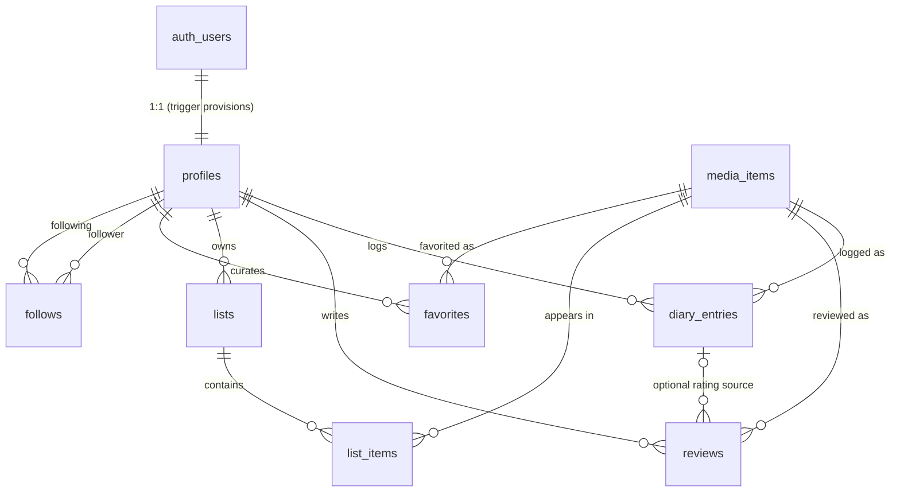

# Backend architecture

> **Status:** infrastructure established, authentication wired, and the full
> persistent diary-entry lifecycle live. Authentication + onboarding and
> **title logging** — create (Log / Rate / Review → the atomic
> `public.log_media(...)` RPC), **edit** (`public.update_diary_entry(...)`), and
> **delete** (`public.delete_diary_entry(...)`) — are wired to Supabase. An
> authenticated user's `/title/[slug]` personal state, real `/diary`, and real
> `/profile/[username]` (derived statistics, recent titles, and reviews) read
> from Supabase, and the owner gets edit/delete controls on the title's personal
> state and each real diary row; signed-out / no-env visitors keep a clearly
> labelled mock **example** diary (no edit/delete) and mock demo profiles, and
> the title's primary action is a neutral **Log** (never a personalized
> "Watched"/"Read"). The **persistent list loop** — create a list, add a title,
> remove a title (`public.create_list` / `add_list_item` / `remove_list_item`,
> server-generated globally-unique slugs, `public`/`private` visibility) — is
> **implemented and verified locally** at the database + server layer
> (`lib/supabase/lists.ts`, `app/lists/actions.ts`); its title/lists/list-detail/
> profile **UI wiring is the next slice**. The remaining product surfaces
> (catalog browsing, community reviews) still run on the typed mock-data layer
> (`@/lib/data`), and **list editing/deletion/reordering/notes, favorites,
> follows, and likes are deferred**. The generated types
> (`lib/database.types.ts`) are real and drift-checked; the catalog migration
> owns all **28** curated titles; `seed.sql` references that catalog and is
> **local-only**. The app still builds with no Supabase env set.

This document describes the Supabase/PostgreSQL foundation added in Phase 2:
why it exists, the schema, the security model, and the boundaries that keep the
existing architecture intact.

## Why Supabase / PostgreSQL

Favalog needs authentication, a per-user persistence layer, and eventually a
real media catalog. Supabase provides managed PostgreSQL, authentication,
Row Level Security (RLS), auto-generated APIs, and TypeScript type generation
with a first-class local development story via the Supabase CLI. That lets us:

- keep the data model in **plain SQL migrations** (portable, reviewable, and not
  locked to an ORM);
- push authorization **into the database** with RLS rather than trusting
  application code;
- develop and test the whole stack locally with the CLI (no cloud dependency
  for ordinary work).

See [ADR 0001](./adr/0001-supabase-backend.md) for the decision, alternatives,
and consequences.

## Schema overview

All application tables live in the `public` schema. Migrations under
`supabase/migrations/` are the **single source of truth** — the database is
never edited out of band.

| Table           | Purpose                                             |
| --------------- | --------------------------------------------------- |
| `profiles`      | Public identity, 1:1 with `auth.users`              |
| `media_items`   | Unified catalog of movies / TV / books              |
| `diary_entries` | Chronological per-user log events (watched / read)  |
| `reviews`       | Long-form reviews, optionally tied to a diary entry |
| `lists`         | User-authored cross-media collections               |
| `list_items`    | Ordered membership of media in a list               |
| `favorites`     | A user's ordered, cross-media favorites shelf       |
| `follows`       | Directed follower → following relationships         |

### Enums

PostgreSQL enums are used only for stable, bounded domains:

- `media_kind` — `movie | tv | book`
- `list_visibility` — `public | followers | private`

Values expected to evolve (genres, review moods, etc.) are **not** enums.

### Keys, constraints, and indexes

- **UUID primary keys** (`gen_random_uuid()`) everywhere except `follows`,
  which uses a composite `(follower_id, following_id)` primary key.
- **Unique identity:** `media_items (source, external_id)` and a unique `slug`;
  `profiles.username` unique **case-insensitively** (via `citext`);
  `lists (user_id, slug)`; `list_items (list_id, media_id)` and
  `(list_id, position)`; `favorites (user_id, media_id)` and
  `(user_id, position)`.
- **Check constraints:** half-star rating ranges (0.5–5.0) on
  `diary_entries.rating` and `reviews.rating`; username format; slug format;
  non-negative positions; `follows` self-follow prevention; and a
  rating-source-of-truth guard on `reviews`.
- **Indexes** cover the real access patterns: media by `kind`/`year`, a GIN
  index on `genres`, diary by `(user_id, logged_at desc)`, reviews by
  `(media_id, created_at desc)` and `(user_id, created_at desc)`, list/favorite
  ownership, and the follows reverse lookup.
- **Timestamps:** every table carries `created_at`; every mutable table also
  carries `updated_at`, kept fresh by the shared `public.set_updated_at()`
  trigger function (pinned `search_path`, no elevated privileges).

### ER diagram



## Ownership relationships

- A `profiles` row is owned by the auth user with the same `id`.
- `diary_entries`, `reviews`, `lists`, and `favorites` are owned by
  `user_id`.
- `list_items` are owned transitively: a user owns a list item when they own
  its parent `lists` row.
- A `follows` row is written only by the `follower_id`.

## RLS strategy

RLS is **enabled on every public application table**. Policies are explicit and
least-privilege; there are deliberately no `using (true) with check (true)`
policies for user-owned writes.

**Public read** (`select using (true)` or a visibility check):

- `media_items`, `profiles`, `reviews`, `diary_entries`, `favorites`, `follows`
- `lists` — only when `visibility = 'public'`, plus the owner always sees their
  own lists
- `list_items` — readable when the parent list is readable

**Owner write** (`auth.uid()` checks on INSERT / UPDATE / DELETE):

- profile owner (`profiles.id`)
- diary-entry / review / list / favorites owner (`user_id`)
- follow relationship creator (`follower_id`)
- `list_items`: writable only when the caller owns the parent list (enforced by
  an `EXISTS` sub-select against `lists`)

**Catalog writes** (`media_items`) have **no** anon/authenticated write policy.
They are performed exclusively by trusted server-side processes using the
**secret (service-role) key**, which bypasses RLS. Privileged writes are never
exposed to a browser client.

`UPDATE` policies always pair a `using` (row visibility) clause with a
`with check` (post-image) clause.

### Public-read decisions and deferred visibility

- **Diary entries are publicly readable.** They back the public-profile
  concept. If per-entry privacy is introduced later, add a privacy column and
  tighten the SELECT policy.
- **`followers` and `private` lists are treated as private** for now: a list is
  publicly readable only when `visibility = 'public'`. Real followers-only
  access is **not faked** — it will be added once the `follows` relationship
  powers a proper policy (a `followers` list becomes readable when
  `EXISTS (select 1 from follows where following_id = lists.user_id and
follower_id = auth.uid())`).

## Ratings source of truth

To avoid representing the same rating inconsistently:

- `diary_entries.rating` records the user's rating **at log time** and is the
  source of truth for a logged event.
- A `reviews` row that references a `diary_entry_id` **must not** carry its own
  `rating` (enforced by a check constraint); its displayed rating resolves from
  the linked diary entry.
- A **standalone** review (no `diary_entry_id`) may carry its own `rating`, so
  an opinion can exist without a formal log event.

## Likes / activity — deferred by design

- **Likes.** The UI shows presentation-only like counts on reviews and lists.
  No `review_likes` / `list_likes` tables are added yet; those counts remain
  mock values until a dedicated persistence task, at which point they can be
  modeled securely (owner-scoped rows + a derived count).
- **Activity.** No generic `activity` table is created. The social feed and
  profile activity are **derivable** from diary entries, reviews, list
  create/update, favorites, and follows. A dedicated event table becomes
  justified only if/when derivation becomes too expensive (e.g. a high-volume
  fan-out feed needing precomputed timelines) — deferred until then.

## Catalog strategy

`media_items` is a unified table for all three media kinds. Commonly queried
fields are normal columns; kind-specific fields live in a `details` JSONB
payload validated at the mapping boundary. A `source` column marks provenance
(`favalog` for curated/internal seed rows) and `(source, external_id)` is the
unique external identity, so a real provider (TMDB, Open Library, Google Books,
…) can be ingested later **without a schema change** and **without** committing
to any provider now.

## Generated types & the domain boundary

- `lib/database.types.ts` is the **database** representation. It is produced by
  `npm run supabase:types` (`supabase gen types typescript --local`). It must
  not be hand-maintained once generation can run.
  > It is now **genuinely generated** from the local stack and guarded by a
  > secret-free **type-drift check** (regeneration must produce no diff).
  > Regenerate only when the schema actually changes; never hand-format it.
- `lib/types.ts` remains the **framework-agnostic domain model** used by the UI.
  Generated row types do **not** replace it.
- `lib/supabase/mappers.ts` is the boundary: it maps `media_items` rows onto the
  `MediaItem` union. It is a small proof of concept (with tests), not a full
  repository layer — building fetchers/repositories is future work.

```
Postgres row  ──(lib/database.types.ts)──▶  mapper  ──▶  domain model (lib/types.ts)  ──▶  UI
```

## Persistent diary-entry lifecycle (create / edit / delete) and reads

The persistent product loop is the full title **log lifecycle**. All three
write paths are narrowly-scoped RPCs that share one security model:
`SECURITY INVOKER` (so RLS is a second, independent boundary), a pinned
`search_path = ''` with fully-qualified objects, ownership derived from
`auth.uid()` (never a client `user_id`), EXECUTE granted to `authenticated`
only (revoked from `public`/`anon`), and a return payload limited to the
identifiers the app needs (no privileged/unrelated row data). A diary-linked
review always stores `rating = null`; the diary entry owns the rating
(half-step 0.5–5.0, validated in the RPC and by the table CHECK).

- **Create.** `public.log_media(...)` (migration `20260806160200`) atomically
  creates a `diary_entries` row and, when a non-empty review body is supplied,
  a linked `reviews` row in one transaction. It resolves the title from a
  trusted **slug** server-side (the browser never supplies media metadata).
- **Edit.** `public.update_diary_entry(p_diary_entry_id, …)` (migration
  `20260812164500`) updates the caller's **own** entry and its optional linked
  review in one transaction: it changes the logged date, rating (passing `null`
  **removes** an existing rating), and revisit flag, and **upserts** the linked
  review — creating one when the entry had none, updating it in place
  otherwise, or **removing** it when the review body is cleared (the diary entry
  is retained). A missing or cross-user id resolves to no row and fails safely
  (`P0002`). Returns `{ diary_entry_id, review_id, media_slug }`.
- **Delete.** `public.delete_diary_entry(p_diary_entry_id)` (migration
  `20260812164500`) deletes the caller's **own** entry. Because
  `reviews.diary_entry_id` is `ON DELETE SET NULL` (which would _detach_ rather
  than remove a linked review), the function deletes the caller's linked
  review(s) **explicitly first**, then the entry — atomically, leaving **no
  orphan**. Deleting the newest log lets the previous log (if any) become the
  title's latest personal state, because reads resolve the newest remaining
  entry. Returns `{ diary_entry_id, media_slug }`.
- **Application boundary.** `lib/supabase/log.ts` hosts all three server entry
  points — `logMedia`, `updateDiaryEntry`, and `deleteDiaryEntry`. Each refuses
  to run without Supabase configured, re-validates the user via the auth DAL,
  re-validates/normalizes input (`lib/supabase/log-input.ts`:
  `validateLogInput` / `validateEditInput`, plus a UUID check for delete), calls
  the RPC, and maps any error to a safe message via the pure
  `lib/supabase/log-errors.ts` (`mapLogError` / `mapEditError` /
  `mapDeleteError` — raw DB detail is never surfaced). A success **must** carry
  a non-empty `diary_entry_id`; a malformed/absent RPC identifier becomes a
  generic error rather than a false success. Each then revalidates `/diary`, the
  title route, and the author's `/profile/[username]` (slug from the RPC's
  server-resolved catalog identity, username from the DAL — never the client)
  via the shared `revalidateDiaryWrite` helper.
- **Server Actions.** `app/title/[slug]/actions.ts` (`logTitleAction`) is the
  create boundary; `app/diary/actions.ts` (`editDiaryEntryAction` /
  `deleteDiaryEntryAction`) are the edit/delete boundaries shared by the diary
  and title UIs. Each reads only allow-listed fields (never a user id, media
  UUID, username, or ownership field — see `app/title/[slug]/log-form.ts` and
  `app/diary/diary-form.ts`), independently re-checks authentication and profile
  completeness, routes signed-out / incomplete cases through the safe `returnTo`
  flow, and returns a serializable state for `useActionState`. They do not
  duplicate the RPC call.
- **UI.** The shared, presentational `LogDialog` (create or edit mode, its
  action injected as a prop so it never imports a server module) and
  `DeleteLogDialog` back the owner controls on the title's personal-state area
  (`MediaActions`) and each real diary row (`DiaryEntryActions`). Edit opens
  pre-filled from the stored entry; delete requires an explicit second-step
  confirmation. These controls render only for the authenticated owner — never
  signed-out or on the example diary.
- **Reads.** `lib/supabase/diary.ts` provides `getMyLatestLogForSlug` (the
  title's per-viewer personal state, now including the linked review's
  title/body/spoiler flag so an edit can pre-fill) and `getMyDiary` (the
  authenticated user's diary as `DiaryEntryView[]`, each real row carrying an
  owner-only `edit` payload). `lib/supabase/profile-activity.ts`
  (`getRealProfileActivity`) derives a real profile's statistics, recent
  titles, and reviews. All embed related rows (no N+1), map through the
  mapper/view-model boundary, and resolve a linked review's effective rating
  from its diary entry.

### Mock vs. real boundary

- `/diary`: authenticated + configured → real diary; signed-out or no-env →
  clearly labelled mock **example** diary (never attributed to the visitor); a
  query error → safe error state (no silent mock fallback).
- `/profile/[username]`: mock demo usernames render full mock profiles; other
  usernames resolve to a real profile with derived activity; unknown →
  `notFound()`. A real profile never inherits mock data, and real reviews show
  no fabricated like counts.

## Persistent list loop (create / add / remove) and reads

The first persistent **list** loop — sign in → create a list → add a title →
view the real list → see it on the owner's profile → add/remove other titles —
is backed by three narrowly-scoped RPCs that share the **same** security model
as the diary RPCs: `SECURITY INVOKER` (RLS is an independent second boundary), a
pinned `search_path = ''` with fully-qualified objects, ownership derived from
`auth.uid()` (never a client `user_id`), EXECUTE granted to `authenticated` only
(revoked from `public`/`anon`), catalog identity resolved server-side from a
trusted **slug**, and a return payload limited to the identifiers/routing data
the app needs.

### Route identity: globally-unique server-generated slugs

`/list/[slug]` must resolve to **exactly one** list, but `lists.slug` was
originally unique only **per owner** (`lists_user_id_slug_key`). Migration
`20260814160000_list_slug_global_unique.sql` adds a forward-only **global**
unique index `lists_slug_global_key on lists (slug)` (strictly stricter than the
per-owner index, which is kept — migrations are immutable). A `DO` guard makes
the migration **fail loudly** with a descriptive message if unexpected duplicate
slugs already exist across owners (none are expected, because persistent list
creation was never previously exposed).

Slugs are generated **server-side** by `create_list` from a readable base
(`<username>-<title>`, slugified) plus a deterministic numeric suffix on
collision. Uniqueness is enforced by the **INSERT** (retry-on-`unique_violation`
with a bumped suffix), which is correct even against other users' private-list
slugs that RLS would hide from a pre-`SELECT`. A slug is **immutable**: renaming
a list later never changes its URL, and the browser never supplies a slug.

### The three RPCs (`20260814160100_list_rpcs.sql`)

- **Create.** `public.create_list(p_title, p_description, p_is_ranked,
p_visibility, p_media_slug)` inserts a list owned by the caller with a
  generated slug, validates the title (1–150) / description (≤2000) for clean
  mapped errors, accepts **only** `public` / `private` visibility (the enum's
  `followers` and the domain-only `unlisted` are rejected), and — when an
  optional trusted `p_media_slug` is supplied — adds that title at position 0 in
  the **same transaction** (so "create a list from the title dialog" is atomic).
  Returns `{ list_id, slug, added_media_slug }`.
- **Add.** `public.add_list_item(p_list_id, p_media_slug)` appends a trusted
  catalog title to a list the caller owns. It **locks the parent list row**
  (`for update`) so concurrent adds cannot collide, appends at the next
  contiguous zero-based position, is **idempotent** (an already-present title
  returns `{ already_present: true }` with its existing position — never a
  duplicate or a raw unique-constraint error), and bumps the list's
  `updated_at`. Returns `{ list_id, slug, media_id, position, already_present }`.
- **Remove.** `public.remove_list_item(p_list_id, p_media_slug)` removes a title
  from a list the caller owns, then **compacts** the remaining positions to a
  contiguous `0..n-1` range. Compaction parks rows at a temporary **positive**
  offset above the current max (never negative — the `list_items` non-negative
  CHECK — and disjoint from both the old and new ranges, so no ordering can
  cause a transient `(list_id, position)` duplicate). Removing an absent title
  is idempotent (`{ removed: false }`). Returns
  `{ list_id, slug, media_id, removed }`.

A missing/cross-user `p_list_id` resolves to no owned row and fails safely
(`P0002`); an unknown media slug fails safely (`P0002`); an unauthenticated
caller is rejected both by the grant and by an in-function `auth.uid()` guard
(`28000`).

### Visibility reconciliation

The DB enum `list_visibility` is `public | followers | private`; the domain
`ListVisibility` in `lib/types.ts` was `public | unlisted | private`. These are
reconciled: `ListVisibility` now matches the enum (`public | followers |
private`), and a new `ListCreateVisibility` (`public | private`) is the only set
a user may choose this phase. `followers` remains represented but unenforced
until follower-aware access exists.

### Application boundary

- `lib/supabase/lists.ts` hosts the server entry points. Writes (`createList`,
  `addListItem`, `removeListItem`) mirror `log.ts`: refuse to run when Supabase
  is unconfigured (`unavailable`), independently re-check the authenticated user
  **and a complete onboarded profile** via the auth DAL, re-validate/normalize
  input (`lib/supabase/list-input.ts`), call the RPC, treat a missing/malformed
  RPC identifier as a failure (never a false success), map errors to safe
  messages (`lib/supabase/list-errors.ts` — raw DB detail never surfaced), and
  revalidate `/lists`, the real `/list/[slug]` (by the RPC's canonical slug),
  the `/title/[slug]` route, and the author's `/profile/[username]` (username
  from the DAL — never the client). Reads (`getMyListsWithMembership`,
  `getMyLists`, `getPublicLists`, `getRealListBySlug`, `getRealListsForUser`)
  are owner/visibility-scoped by RLS and return serializable view models via the
  pure `lib/supabase/list-view-model.ts` mappers — never raw rows, and never a
  fabricated like count or curator note on a real list.
- **Server Actions.** `app/lists/actions.ts` (`createListAction`,
  `addListItemAction`, `removeListItemAction`) are the only Client-callable
  entry points. Each reads only allow-listed fields (never a user id, media
  UUID, username, position, or ownership field — see `app/lists/list-form.ts`),
  routes signed-out / incomplete-profile cases through the safe `returnTo` /
  onboarding flow, and returns a serializable `useActionState` state. They do
  not duplicate the RPC call.

### Ordering, likes, notes — deferred

This phase supports **append** and **remove** only (new titles append; removal
compacts). Ranked lists display their stored order as a ranking; unranked lists
still preserve deterministic order. **Drag-and-drop / arbitrary reordering,
curator-note creation/editing, list metadata editing, list deletion, list
likes, and follower-aware visibility are deferred.** Real lists carry no
persisted like count (honestly absent, never faked).

### Mock vs. real list boundary

The curated mock discovery experience on `/lists` is retained but labelled as
editorial/example content; a configured environment additionally surfaces the
signed-in user's **real** lists and a strictly-`public` **community** section.
Existing mock demonstration lists on `/list/[slug]` and mock demo profiles keep
using mock list data; a **real** list/profile never inherits mock lists, counts,
owners, notes, or likes. A read failure shows a controlled error state rather
than silently substituting mock lists as the user's own.

## Supabase clients

Per current `@supabase/ssr` guidance (the deprecated `@supabase/auth-helpers-*`
packages are **not** used):

- `lib/supabase/client.ts` — `createBrowserClient` for Client Components.
- `lib/supabase/server.ts` — `createServerClient` bound to request cookies via
  `next/headers`, created **per request** (no shared global server client).
- `lib/supabase/session.ts` + root `proxy.ts` — session-cookie **refresh only**
  (Next.js 16 renamed the `middleware` convention to `proxy`). It performs no
  authorization/redirects and is a no-op when Supabase is unconfigured. The
  matcher excludes Next internals and static assets.

## Environment variables

Only public configuration uses the `NEXT_PUBLIC_` prefix:

| Variable                               | Scope           | Required for app startup |
| -------------------------------------- | --------------- | ------------------------ |
| `NEXT_PUBLIC_SUPABASE_URL`             | browser+server  | No (mock-data phase)     |
| `NEXT_PUBLIC_SUPABASE_PUBLISHABLE_KEY` | browser+server  | No (mock-data phase)     |
| `SUPABASE_SECRET_KEY`                  | **server only** | No — future admin only   |

`lib/supabase/env.ts` never throws at import time, so the app keeps building and
rendering on Vercel with none of these set. `.env.example` documents the names
(no secrets). The secret key is never read from shared/client code.

## Local development commands

Requires Docker Desktop (or a compatible runtime) running.

```bash
npm run supabase:start    # start the local stack (Postgres, Auth, Studio, …)
npm run supabase:status   # print local URLs + keys (fill .env.local from here)
npm run supabase:reset    # drop, re-apply all migrations, then run seed.sql
npm run supabase:types    # regenerate lib/database.types.ts from the local DB
npm run db:test           # run the pgTAP tests in supabase/tests/
npm run supabase:stop     # stop the local stack
```

Typical first run:

```bash
npm run supabase:start
npm run supabase:status          # copy URL + publishable key
cp .env.example .env.local       # then paste the values in
npm run supabase:reset           # apply migrations + seed
npm run db:test                  # verify constraints + RLS
```

## Remote project linking / deployment

Not required for local development. When a hosted project is created:

```bash
supabase login
supabase link --project-ref <your-project-ref>
supabase db push                 # apply local migrations to the linked project
```

CI/PR builds must **not** require remote Supabase credentials (see the CI
section in the README). The secret key, database password, and privileged
connection strings are configured only in server-side deployment settings and
are never committed or logged.

**Applying the logging migrations to a hosted project.** The four new
forward-only migrations — `20260806160000` (table grants), `20260806160100`
(28-title catalog), `20260806160200` (`log_media` RPC), `20260806160300`
(profile-trigger collision fix) — are committed but must reach the hosted
project via `supabase db push`. **Never** use `supabase db reset --linked`,
remote `seed.sql`, `--include-seed`, or out-of-band dashboard schema edits (the
seed's `auth.users` inserts are local-only). Safe procedure:

```bash
supabase link --project-ref <hosted-dev-ref>   # confirm the exact project
supabase migration list --linked               # inspect the remote ledger
supabase db push --dry-run                      # review the plan (expect only
                                                # the 4 migrations above)
supabase db push                                # apply after review
```

After applying, verify: all four migrations appear in the remote ledger; exactly
28 `source = 'favalog'` catalog rows exist with resolvable slugs; `authenticated`
has the required table privileges while `anon` keeps read-only; `authenticated`
can `execute log_media` while `anon`/`public` cannot; a disposable authenticated
user can create a log (with an optional atomic linked review whose `rating`
stays null and whose rating lives on the diary entry); a second user cannot
mutate the first's rows; unknown media is rejected; and the browser never uses
the service-role key. Clean up disposable test data afterward.

> **Hosted status at time of writing:** these migrations have **not** yet been
> confirmed applied to the hosted development project from this environment.
> Apply and verify them with the procedure above before relying on the hosted
> logging loop.

### Deploying the edit/delete migration (`20260812164500`)

The edit/delete lifecycle adds **one** new forward-only migration —
`20260812164500_edit_delete_diary_entry_rpcs.sql` (the
`update_diary_entry` / `delete_diary_entry` RPCs and their grants). Existing
migrations are immutable; this migration only `create or replace`s two new
functions and re-grants EXECUTE, so it is additive and safe to push. Apply it to
the hosted project the same way (never `db reset --linked`, never remote seed):

```bash
supabase link --project-ref <hosted-dev-ref>   # confirm the exact project
supabase migration list --linked               # inspect the remote ledger
supabase db push --dry-run                      # expect ONLY 20260812164500
supabase db push                                # apply after review
```

**Post-deployment SQL checks** (run read-only against the hosted DB, e.g. in the
SQL editor):

```sql
-- 1) The migration is recorded in the remote ledger.
select version from supabase_migrations.schema_migrations
where version = '20260812164500';

-- 2) Both functions exist as SECURITY INVOKER with a pinned search_path.
select p.proname, p.prosecdef as security_definer, p.proconfig
from pg_proc p join pg_namespace n on n.oid = p.pronamespace
where n.nspname = 'public'
  and p.proname in ('update_diary_entry', 'delete_diary_entry');
--   expect security_definer = false and proconfig = {search_path=""}

-- 3) EXECUTE is granted to authenticated only (not anon/public).
select has_function_privilege('authenticated',
  'public.update_diary_entry(uuid, timestamptz, numeric, boolean, text, text, boolean)', 'execute') as authed_update,
  has_function_privilege('anon',
  'public.update_diary_entry(uuid, timestamptz, numeric, boolean, text, text, boolean)', 'execute') as anon_update,
  has_function_privilege('authenticated', 'public.delete_diary_entry(uuid)', 'execute') as authed_delete,
  has_function_privilege('anon', 'public.delete_diary_entry(uuid)', 'execute') as anon_delete;
--   expect authed_* = true, anon_* = false
```

**Manual production verification checklist** (after deploy, with a disposable
account; clean up test rows afterward):

1. Sign in, open a title you have logged, and **edit** the entry — change the
   date and rating, and confirm the title personal state, `/diary`, and your
   `/profile/[username]` all reflect the change after it saves.
2. **Remove** the rating on an entry (clear it) and confirm the rating
   disappears everywhere.
3. **Add** a review to an entry that had none, **update** it, then **clear** its
   body — confirm the linked review is created, updated, and then removed while
   the diary entry itself remains.
4. Log a title **twice**, **delete** the newer entry, and confirm the older log
   becomes the title's latest personal state (not "unlogged").
5. **Delete** an entry that has a review and confirm no orphaned review remains
   on your profile/diary.
6. Confirm a signed-out visitor sees a neutral **Log** action (no
   "Watched"/"Read", no edit/delete controls) and that Log/Rate/Review route to
   the safe sign-in `returnTo`.
7. Confirm the browser never receives the service-role key.

> **Hosted status for edit/delete:** this migration has **not** been applied to,
> or verified against, the hosted project from this environment. It was
> developed and verified **locally only** (local reset + full pgTAP suite +
> byte-identical type regeneration). Apply and verify it with the procedure and
> checklist above before relying on the hosted edit/delete lifecycle.

### Deploying the persistent-list migrations (`20260814160000`, `20260814160100`)

The persistent-list foundation adds **two** new forward-only migrations, taking
the total to **16**:

- `20260814160000_list_slug_global_unique.sql` — the global-unique slug index
  (with the fail-loud duplicate guard).
- `20260814160100_list_rpcs.sql` — the `create_list` / `add_list_item` /
  `remove_list_item` RPCs and their `authenticated`-only grants.

Existing migrations are immutable; these are additive (a new index + three new
functions). Apply them the same way (never `db reset --linked`, never remote
seed):

```bash
supabase link --project-ref <hosted-dev-ref>   # confirm the exact project
supabase migration list --linked               # inspect the remote ledger
supabase db push --dry-run                      # expect ONLY 20260814160000
                                                # and 20260814160100
supabase db push                                # apply after review
```

**Post-deployment SQL checks** (run read-only against the hosted DB):

```sql
-- 1) Both migrations are recorded in the remote ledger.
select version from supabase_migrations.schema_migrations
where version in ('20260814160000', '20260814160100')
order by version;

-- 2) The global-unique slug index exists.
select indexname from pg_indexes
where schemaname = 'public' and tablename = 'lists'
  and indexname = 'lists_slug_global_key';

-- 3) All three functions are SECURITY INVOKER with a pinned search_path.
select p.proname, p.prosecdef as security_definer, p.proconfig
from pg_proc p join pg_namespace n on n.oid = p.pronamespace
where n.nspname = 'public'
  and p.proname in ('create_list', 'add_list_item', 'remove_list_item');
--   expect security_definer = false and proconfig = {search_path=""}

-- 4) EXECUTE is granted to authenticated only (not anon/public).
select
  has_function_privilege('authenticated',
    'public.create_list(text, text, boolean, text, text)', 'execute') as authed_create,
  has_function_privilege('anon',
    'public.create_list(text, text, boolean, text, text)', 'execute') as anon_create,
  has_function_privilege('authenticated',
    'public.add_list_item(uuid, text)', 'execute') as authed_add,
  has_function_privilege('anon',
    'public.add_list_item(uuid, text)', 'execute') as anon_add,
  has_function_privilege('authenticated',
    'public.remove_list_item(uuid, text)', 'execute') as authed_remove,
  has_function_privilege('anon',
    'public.remove_list_item(uuid, text)', 'execute') as anon_remove;
--   expect authed_* = true, anon_* = false
```

**Manual production verification checklist** (with a disposable account; clean up
test rows afterward):

1. Sign in and **create** a public list from `/lists`; confirm it appears under
   your real "Your lists" and its `/list/[slug]` renders your identity with an
   empty owner-aware state.
2. From a title page, use **Add to list** to add that title, then confirm it
   appears in the real list and on your `/profile/[username]`.
3. **Add** a second and third title; confirm they append in order and the
   positions stay contiguous.
4. **Remove** the middle title; confirm the remaining titles stay contiguous and
   the list's updated time changes.
5. Add the **same** title twice; confirm it is not duplicated.
6. Create a **private** list; confirm a signed-out visitor and a second account
   cannot see it or its `/list/[slug]`, while you can.
7. Confirm a signed-out visitor sees **Add to list** as a sign-in link (no
   dialog, no membership state) routing through the safe `returnTo`.
8. Confirm the browser never receives the service-role key.

> **Hosted status for persistent lists:** these two migrations have **not** been
> applied to, or verified against, the hosted project from this environment.
> They were developed and verified **locally only** (local reset + full pgTAP
> suite + byte-identical type regeneration). Apply and verify them with the
> procedure and checklist above before relying on the hosted list loop.

## Seed assumptions

`supabase/seed.sql` loads a **small, representative** dataset (not a migration
of the full mock catalog):

- Three **local test users** are inserted directly into `auth.users` using the
  documented Supabase local-dev pattern (bcrypt via `pgcrypto`); the profile
  trigger then provisions their `profiles`. All use `@example.com` emails and
  the password `password123`. This direct insert is **local only** — remote
  environments should provision users through the Auth API.
- The curated cross-media catalog is owned by the **catalog migration**
  (`20260806160100`), which inserts all **28** `source = 'favalog'` titles with
  stable slugs. `seed.sql` **references** that catalog (it does not redefine a
  smaller one) and adds local diary entries (including a rewatch), a
  diary-linked review and a standalone review, a ranked public list and a
  private list with items, favorites, and follows. The seed's direct
  `auth.users` inserts are **local-only** and must never run against a remote
  project.

## Deferred decisions

- **List management beyond the create / add / remove loop:** editing a list's
  title, description, ranking mode, or visibility after creation; deleting a
  whole list; drag-and-drop / arbitrary reordering; and curator-note
  creation/editing. (Persistent list **create / add-title / remove-title** now
  exist — see "Persistent list loop" above — and are verified locally.)
- Favorites, follows UI, and real likes persistence for reviews **and** lists
  (and any dedicated activity/event table).
- Migrating the remaining product surfaces (catalog browsing, community
  reviews) off mock data to Supabase-backed fetchers.
- Real media-catalog provider integration.
- Full followers-only list visibility enforcement.
