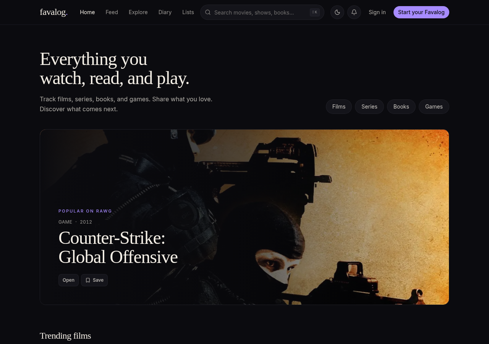
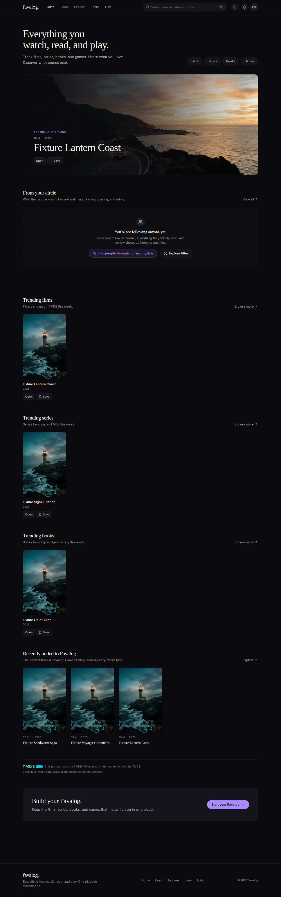
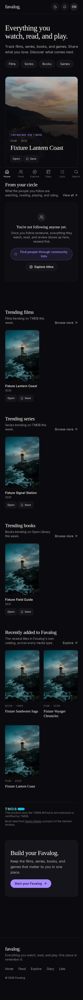

# Favalog: engineering case study

Favalog is a cross-media record for movies, TV, books, and video games. You
discover a title, save it to a list, log it in a diary, review it, and share
it with the people who follow you. This document covers the engineering
decisions behind it and the evidence for each claim. It does not claim
anything that isn't verified in code, CI, or owner-confirmed production
behaviour.

## Current release evidence (2026-09-30)

The owner merged [PR #22](https://github.com/jedemarco1030/favalog/pull/22) into
main `f1a392e2d43dad39e690383451b829b77824f361`, an identical tree to final
review source `cf82d647d5ccbb685ec5aba25b9c5e48a7ecaa37`.
[Final PR CI 36771309279](https://github.com/jedemarco1030/favalog/actions/runs/36771309279)
completed successfully: 1,615 unit/component tests across 166 files, 617 pgTAP
tests across 19 files, byte-identical generated types and both builds passed.
Downloaded reports confirm 34 retry-free fixtures, 20 retry-free first-list
repetitions plus setup, configured Explore 15 passes/one paid-semantic skip,
eight provider-layout passes, production fixture-refusal one pass, and feed
and likes one pass each. Default no-env has 44 passes/six intentional skips;
explicit no-env has five passes/no skips. No E2E failures, retries or flaky
outcomes occurred. The [new main run](https://github.com/jedemarco1030/favalog/actions/runs/36773633454)
completed successfully. Its independently downloaded reports confirm all
counts above, byte-identical types, the required quality evidence and ten fresh
desktop/mobile captures. **MVP 1 engineering closeout complete; beta acceptance
pending these owner checks.** The
[release checklist](mvp1-release-checklist.md) retains explicit owner
migration/deployment, real-account, accessibility and operational acceptance.

The final CI hardening reserves Supabase ports before Docker image pulls so
outbound ephemeral allocation cannot consume them, retains owner/socket
state diagnostics, and gates dependent Explore invocations on successful
prerequisites. It does not kill unknown listeners, relax assertions or hide
setup failures. Read-only Auth readiness avoids starting fixtures before the
local admin endpoint returns usable data. The original listener's identity
remains unknown; passing later attempts do not erase that limitation.

Fresh read-only production inspection confirms that Paper Watch is absent
from the local query result and its saved title route carries a demonstration
notice. That is not full migrated retrieval or authenticated owner acceptance.
The refresh environment currently lacks reviewer and branch protections; its
five latest schedules skipped, and activation-variable access returned 403.
No hosted migration, dispatch, save, embedding job or secret change was made.

### Historical candidate evidence

[Post-merge main CI 36749917450](https://github.com/jedemarco1030/favalog/actions/runs/36749917450),
source `1c076a3`, confirms 20 first-list repetitions without retries, 34 fixture
passes and one following-feed pass. This supersedes the earlier pending JSON
transport verification described as history below. Likes failed before browser
execution on that baseline. [PR #22 CI 36760089274](https://github.com/jedemarco1030/favalog/actions/runs/36760089274),
application source `76bb608`, executes likes and following feed successfully but
**fails overall**: the inspected fixture report has five retry attempts, one
flaky duplicate-save test, one failed materialization and seven cascade skips.
Configured Explore has 15 passes/one paid-semantic skip; first-list has 20
retry-free repetitions plus setup. All eight provider-layout scenarios and
production fixture-refusal pass independently. Application source `5847189`
fixes the obsolete mock-slug assertion and returns existing-list/save-only
results as bounded JSON independent of unrelated RSC refresh streams, preserving
authentication, RLS and safe redirects.
[CI 36763709617](https://github.com/jedemarco1030/favalog/actions/runs/36763709617)
completed successfully; downloaded reports confirm 34 retry-free fixtures,
20 retry-free first-list repetitions plus auth setup, configured 15 passes/one
paid-semantic skip, eight independent provider-layout passes, production
fixture-refusal one pass, and likes/feed one pass each. Default no-env has
44 passes/six intentional skips; explicit no-env has five passes/no skips.
There are no retries or flaky outcomes in any revised-source invocation.
Validation, builds and database/type drift pass, with byte-identical generated
types. Final documentation/capture-branch and post-merge evidence were still
gates on that historical candidate; see current evidence above.

The follow-up addresses a separate identity/presentation defect: exact legacy
mock identities persisted as ordinary catalog rows. Its forward-only retrieval
filters preserve every saved identity/reference, keep genuine internal records,
and prevent provider imports from linking to similar-name demonstrations.
Configured title pages now resolve real database content rather than preferring
mock records, and no longer fabricate related recommendations or rating charts.
Missing/broken artwork has an intentional fallback; synthetic bundled imagery
cannot become a provider backdrop. The migration and final-source CI are still
owner/review dependencies, not completed production work. Inbucket port 54324's
listener owner remains unknown because GitHub denied a single requested rerun;
new scoped startup diagnostics are not a claimed root-cause fix.

[Production mobile Home](screenshots/home-mobile-production.png).
Captured read-only on 2026-09-30 at 1280×900 and 390×844 after visible artwork
decoded. These are genuine deployed-baseline captures, not images of the
unapplied follow-up or proof of release acceptance.

Additional final-application-source development-preview captures use genuine
provider content, not synthetic covers, and were visually inspected after
visible images decoded. Desktop/mobile Home, Explore, provider search and
Open Library title captures are linked in the
[quality evidence index](quality/baseline.md#follow-up-source-evidence-2026-09-30).
The hosted retrieval migration remains unapplied; these captures do not prove
its search exclusion or authenticated Save behavior.

The earlier follow-up passed 1,562 unit/component tests and focused browser
presentation checks. Revised-source CI completed 1,574 tests across 163 files
and both builds; local coverage reported the same tests but exited 137 even
after one single-worker recovery, so that local check remains incomplete.
Native Playwright and local database verification were blocked by unavailable
browser libraries/Docker. The final PR and post-merge main CI recorded above now
complete the required independent CI gate; those local checks remain incomplete.
The synthetic golden evaluation corpus is explicitly local-only; live semantic
quality requires a reviewed genuine-provider dataset and is not claimed here.

## Historical fixture captures

Actual application captures from local Supabase and offline provider fixtures,
[CI 36666650203](https://github.com/jedemarco1030/favalog/actions/runs/36666650203),
source `3bc4561`, inspected on desktop and mobile. Artwork is synthetic and is
not an authentic cover for the fixture title. These are not production screenshots
or evidence that the overall failing save/zoom run passed. Explore/title captures
were rejected for unrelated placeholder cards and require a fresh fixture capture.

## The problem

Entertainment trackers usually split by medium: one app for films, one for
books, one for games. Favalog treats media type as a property of a title,
not a separate product. The hard part is the catalog. No single provider
covers every medium, provider ids are unstable across providers, and copying
whole provider catalogs into a database is both expensive and, for some
providers, contractually restricted.

## Key decisions

**Discovery reads from providers; the catalog stores only what people use.**
TMDB, Open Library, and RAWG are read server-side through provider-neutral
adapters (`lib/catalog/`). A title enters the canonical catalog only when
someone saves, logs, or reviews it. The only write path is the `service_role`
RPC `materialize_media_item(...)`. It accepts an identity (provider plus
external id), never client-supplied metadata, and the server re-fetches and
normalizes the data itself. Aliases live in `media_external_ids`, so the same
title can't be imported twice. See ADR 0004.

**Row Level Security is the authorization layer, not the UI.** Every user
table has RLS. RPCs are `SECURITY INVOKER` and scoped to `auth.uid()`, and
every Server Action re-validates the user with `supabase.auth.getUser()`.
Follower-only list visibility is enforced in Postgres, and pgTAP tests cover
the policies. See ADRs 0001, 0002, and 0005.

**Hybrid search with honest degradation.** Explore fuses Postgres full-text
search and pgvector with Reciprocal-Rank Fusion, protects exact title
matches, and applies a semantic relevance cutoff. Embeddings run only for
providers whose terms permit it: RAWG is keyword-only and blocked in code
until its permission is documented. With embeddings unavailable, search
falls back to keyword-only rather than failing. See ADR 0003 and the AI
discovery system card.

**Failures are isolated per shelf.** Each discovery shelf fetches, caches,
and fails independently. A failing provider hides its own shelves and emits a
redacted, schema-versioned event (`docs/ai-discovery-operations.md`). The
page itself doesn't error.

**Save completion must not depend on streamed page refresh.** Saving materializes
the title, then adds it to a list. First-attempt traces reproduced the first-list
pending stall with two successive Server Actions. Combining them into one still
stalled in seven of twenty retry-free attempts on `3bc4561`; thirteen reached
success and persistence but exposed a separate, over-broad list-link assertion.
The next candidate uses a bounded, same-origin JSON response with independent
session validation and existing per-write authorization/RLS, so unrelated RSC
refresh completion does not hold the dialog pending. A preview check also caught
and fixed a transport regression: external Origin must match the trusted proxy's
forwarded host (or Host), not an internal localhost Request URL. Reverse proxies
must overwrite forwarded headers, as with Next Server Actions. The read-only
anonymous request now returns a safe sign-in continuation, not a 403. Isolated
first-list/full-fixture verification remains required; this is not a claim that
the candidate has passed the browser gate.
A partial failure returns the created list; retry re-runs only save rather than
creating another list. This is not a database transaction or a claim that network
retries are atomic. Signed-out viewers go through sign-in and return to the same
card with its picker open. Every return path is validated as same-origin relative.

## Verification

The sandbox has no Docker-backed local fixture stack; those browser journeys
run in CI. Read-only preview checks can also use v0's remote browser. A
successful compile is never treated as evidence of behaviour. CI verifies:

- Formatting, lint, strict typecheck, Vitest with coverage, a production
  build, and Storybook.
- pgTAP schema and RLS tests against a local Supabase stack, plus a
  generated-types drift check.
- Playwright default/no-env, seeded configured Explore, offline provider
  fixtures, production-refusal, following-feed, social, and likes jobs.
  Mutation-capable suites use isolated local Supabase, independent resets,
  and distinct ports. Each invocation has a machine-readable report and
  execution gate; failures, skips, and retried outcomes remain distinguishable.
- Fixture quality and portfolio capture require settled discovery, successful
  decoded artwork, and a materialized title record. Artwork is fulfilled
  locally before Next's optimizer can contact a provider CDN.

Tests never touch hosted production.

## Measured quality work (Phase 4E)

The quality pass was evidence-first. The first CI change only fixed the
evidence itself: two Playwright runs had been writing to the same report
directory, and the second overwrote the first, so the 12 baseline
measurements were silently missing. Once that was fixed and layout-shift
attribution was added, the baseline showed:

- 2 axe rule violations on each of Home, Explore (empty and searching), and
  the title page: muted-text contrast of about 3.3:1, a prohibited ARIA label
  on the star rating, and an `aria-controls` pointing at an element that
  wasn't always rendered.
- Desktop Explore CLS of 0.0897, which attribution traced to streamed
  discovery shelves pushing down the already-painted catalog browse.

In those historical runs, all four no-env pages reported 0 axe violations on
mobile and desktop. Moving discovery below the catalog produced desktop
Explore CLS 0, but sacrificed discovery-first presentation; that is not the
release solution. PR #21 restores provider shelves first inside a shared
loading boundary with downstream catalog content. Its navigation-start,
settled-state measurements are separate evidence, not a comparable speed
improvement claim. Desktop LCP differences of 20–40 ms in the historical runs
were within runner noise and are not claimed as improvements. Full numbers
and CI run links are in [`docs/quality/baseline.md`](quality/baseline.md).
These are lab measurements, not real-user data, and passing axe does not
establish accessibility compliance. The manual checks are listed in that
document.

## What's not done

- RAWG content is not semantically searchable. The pipeline is implemented and
  fixture-tested, but it stays off until RAWG permission is documented.
- Some community-review surfaces still use the labelled mock layer.
- Social and likes run in CI, but fixture evidence is not owner acceptance.
- The five latest observed catalog-refresh scheduled runs skipped the job;
  the GitHub activation gate and read-only rehearsal require owner verification.
- Real VoiceOver/NVDA, actual browser zoom, and manual artwork contrast remain
  owner checks. Axe incomplete findings are recorded, not called passes.
- [MVP 1 acceptance](mvp1-release-checklist.md) is still pending.
- No notifications, comments, blocking, or private accounts yet.

## How it was built

The project is built with AI assistance. The owner sets the requirements,
reviews and merges every PR, and confirms production behaviour. Each phase
shipped as small PRs with CI evidence attached rather than as one large
change.
